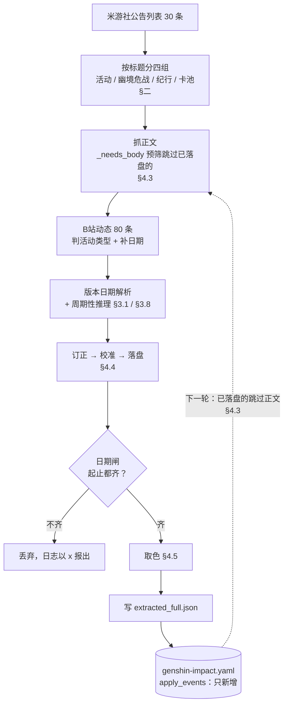
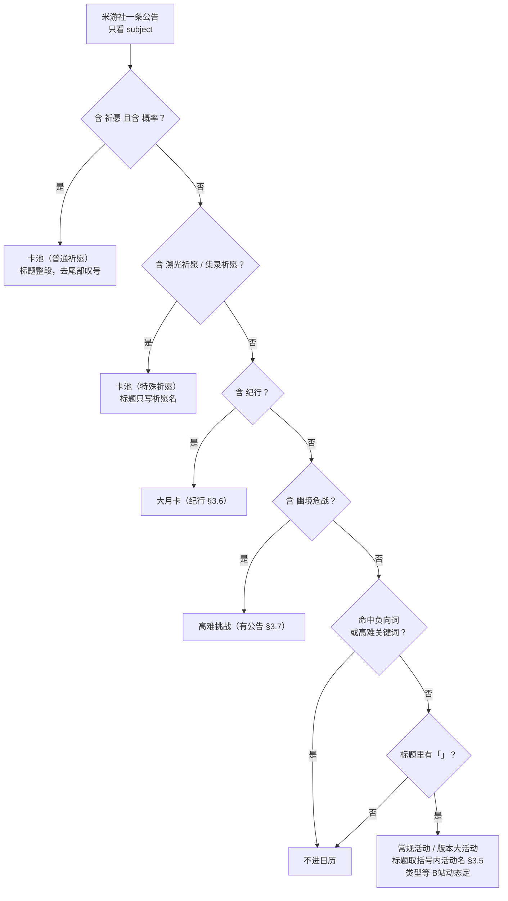
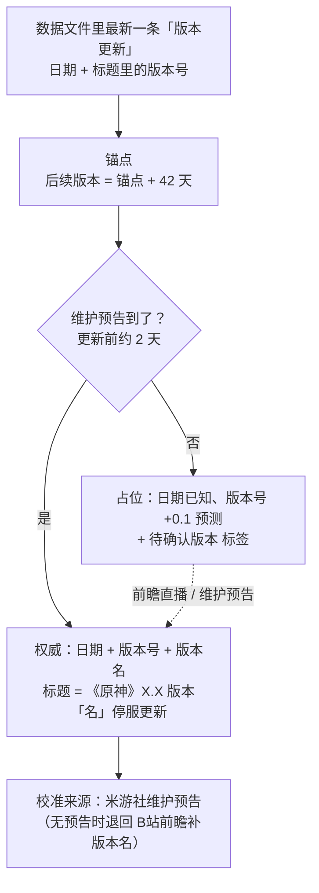
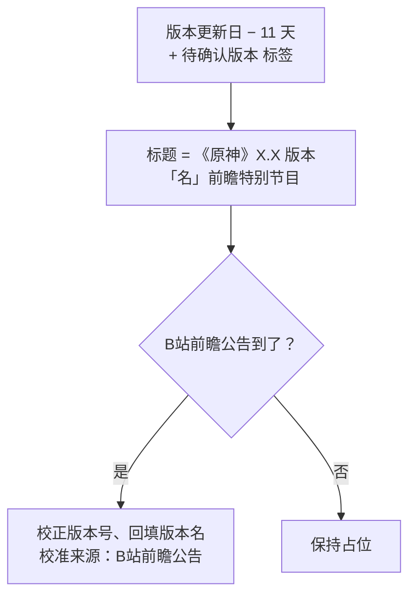
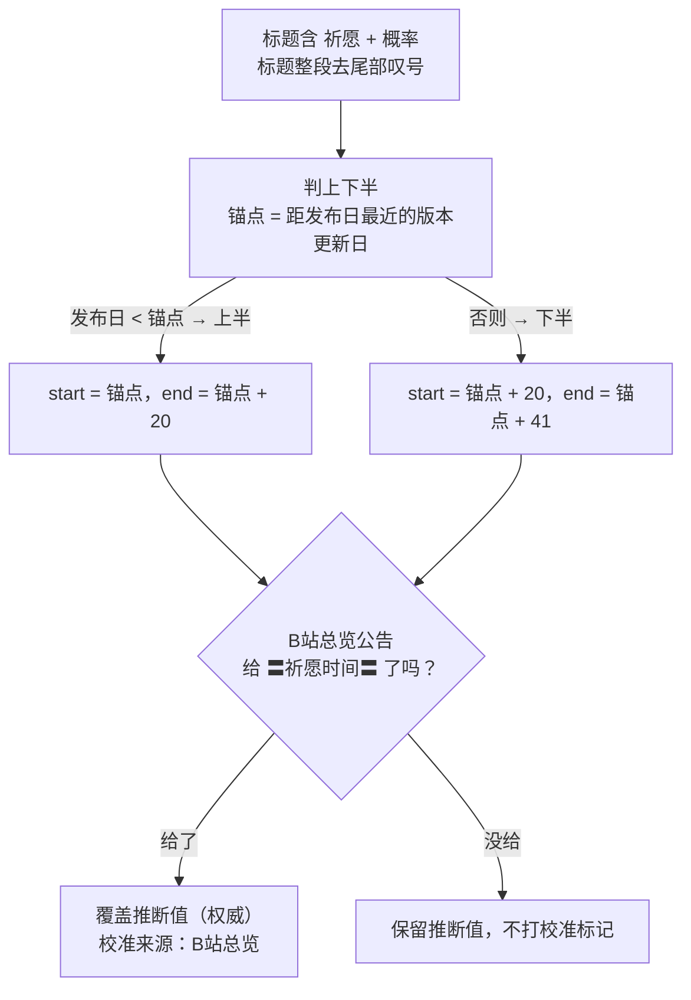
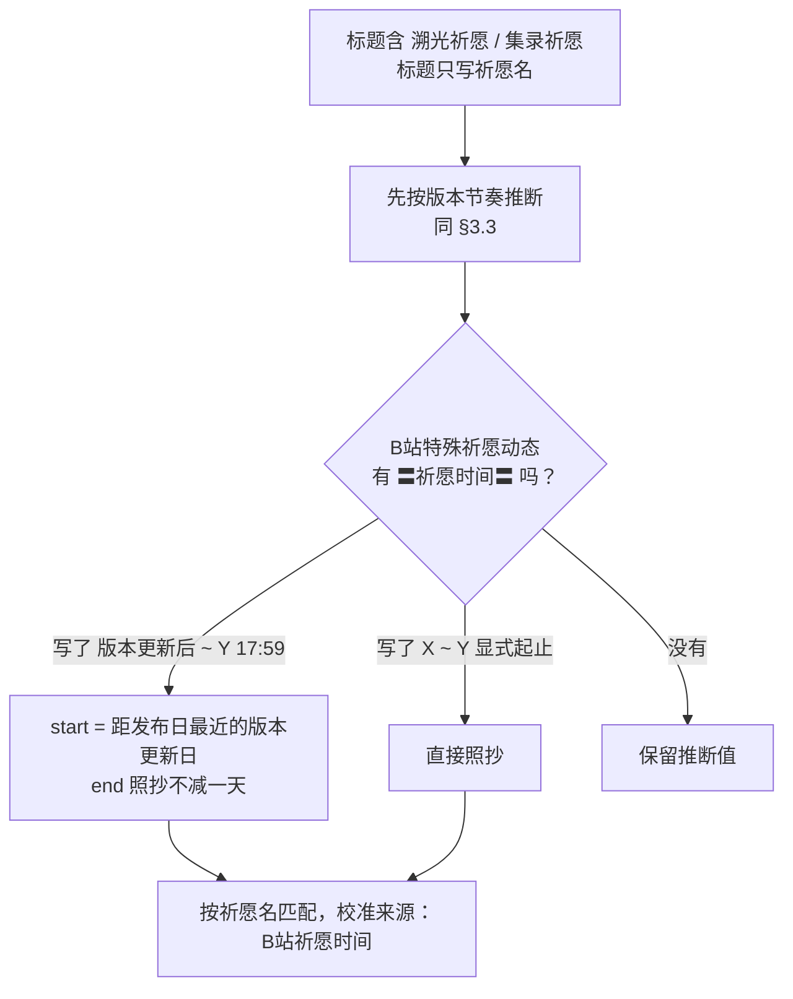
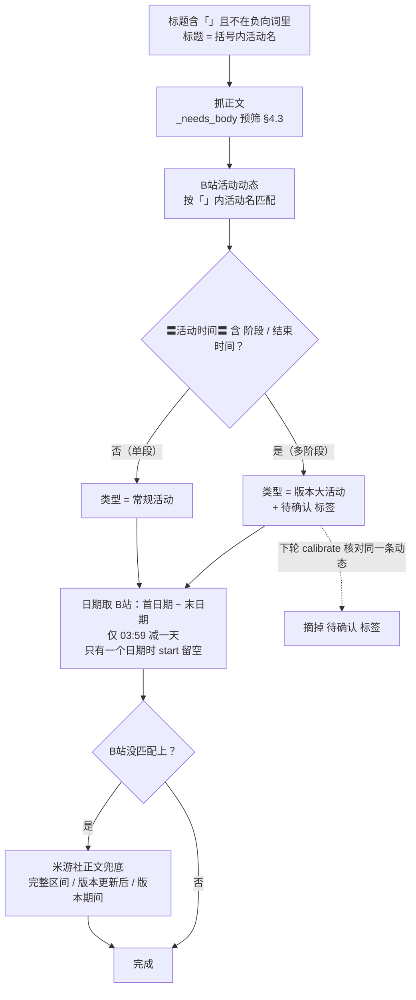
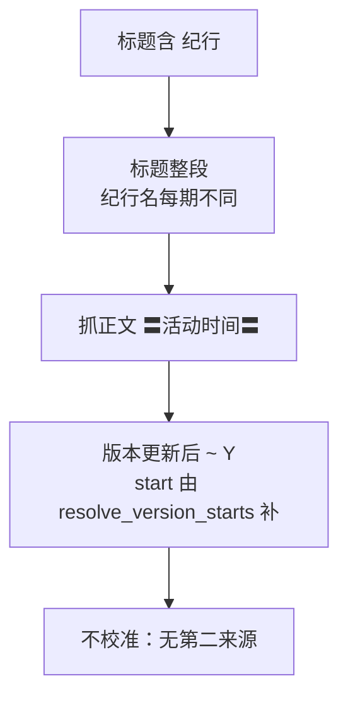
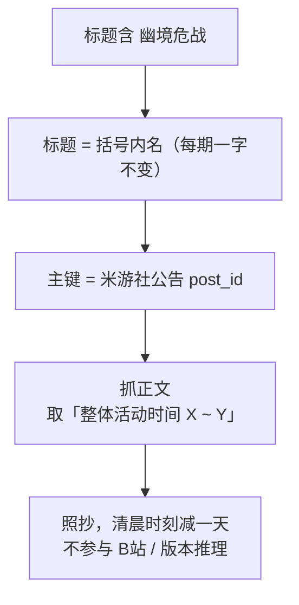
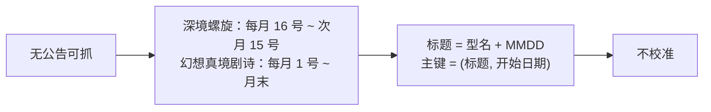

# 原神活动信息的提取与维护规则

本文只讲**管线怎么跑**：一条公告怎么被分类，每一类活动怎么把自己的日期、标题与身份定下来。
现状与已完成 / 未完成清单见 [PLAN.md](PLAN.md)；去重主键与校准的共用机制见
[../common/keys.py](../common/keys.py) 与 [../common/calibrate.py](../common/calibrate.py)；
其余各端的规则在各自目录的 `RULES.md`（本端与它们的差异见 §五）。

> **原神没有「总纲」**：米游社没有一份「每版本开服当天发、含本版全部活动
> 与下版本日期」的公告。所以它需要一套**周期性推理**（`genshin/inference.py`）补版本更新、
> 前瞻直播（B站）、深境螺旋、幻想真境剧诗的日期，卡池日期也是先推后校。这是原神最大的结构
> 差异——不是实现风格不同，是**信息源少了一整块**。
>
> 下面每条规则都由真实公告核对过；与其它端不同，原神**没有离线自检**（见 [PLAN.md](PLAN.md) §2.3）。

---

## 一、总览

### 1.1 数据来源

| 来源 | 位置 | 给出什么 |
|---|---|---|
| **米游社公告栏** | `fetch_post_list` / `fetch_post`，30 条 | 主来源：常规活动、版本大活动、卡池、纪行（大月卡）、幽境危战、网页活动 |
| **米游社维护预告** | 标题含「维护预告」，更新前约 2 天发 | 版本更新日 + 版本号 + **版本名**（最权威） |
| **B站官方账号动态** | `fetch_dynamics(limit=80)` | 卡池日期（米游社卡池正文是图片）、版本大活动的日期与**类型判定**、前瞻直播时间与版本名 |

B站是**补充来源**，只在它确实给出米游社没有的东西时才用：米游社的卡池公告与版本大活动公告
正文是图片，读不到日期；前瞻直播米游社根本不发公告。

### 1.2 一轮的顺序

`python maintain.py`（四端一起跑），或单跑 `python genshin/pipeline.py`：

1. 抓米游社公告列表（30 条）→ 按标题分成四组：活动 / 幽境危战 / 纪行 / 卡池
2. 载入数据文件（供预筛判断哪些已落盘）
3. **抓正文**（四组各自循环）：活动取类型 + 描述 + 日期 + 配图；幽境危战与纪行取日期；
   卡池只取描述与配图（日期走推理）
4. `永久开放` 的条目去掉，不进日历
5. 抓 B站动态（80 条）→ 判活动类型 + 补日期 + 卡池总览 + 特殊祈愿
6. **版本日期解析**：`extract_version_dates` 读出版本更新日 → `resolve_version_starts`
   （`版本更新后 ~ Y` 补起点）、`resolve_version_period`（`版本期间持续开放` 补整段）
7. **卡池日期推理**（`infer_banner_dates`，上下半各 3 周）→ 再用 B站总览 / 特殊祈愿动态覆盖
8. **推理未来周期性事件**（`infer_events`，未来 30 天）：深境螺旋 / 幻想真境剧诗 / 版本更新 /
   前瞻直播，只新增
9. **订正** `correct_from_candidates`（活动类型从 B站动态补上）
10. **校准** `calibrate`（用权威来源核对已有条目），有变更即落盘数据文件
11. 打印 `== 正文抓取 ==` 小结
12. **日期闸**：缺起止的条目丢弃，日志以 `x` 报出
13. **取色**（最后一步）
14. 写 `extracted_full.json` → `apply_events` 只新增



> ⚠️ **原神这一段的顺序与其它端不同**：订正 / 校准排在**日期闸之前**，取色排在**最后**。
> 在本管线无害（原神没有 `pending` 条目，订正那一路不会补 `color`；取色也只服务新增条目），
> 但**若将来给原神接「总纲优先」，必须改成 `日期闸 → 取色 → 订正 → 校准`**，否则订正补不到
> 配色（`common/calibrate.py` 的 `correct_from_candidates` 文档里写着这条前置条件）。

**没有状态文件**：`data/events/genshin-impact.yaml` 自己就是状态——下一轮的预筛（跳过谁）、
推理（版本节奏锚点）、订正（补哪条）、校准（谁还没确认过）都从它读。图里那条虚线回环就是这个意思。

---

## 二、分类方法：一条公告属于哪一类

**只按标题判断，不看正文**（正文关键词命中容易误杀）。四个 `find_*` 函数各自扫一遍列表，
互不依赖；判据按下面的**顺序**排（先命中先定，后面的不再看）：

| 顺序 | 类型 | 判据 | 由谁处理 |
|---|---|---|---|
| 1 | 卡池（普通祈愿） | 标题含 `祈愿` **且**含 `概率` | `find_banner_announcements` |
| 2 | 卡池（特殊祈愿） | 标题含 `溯光祈愿` / `集录祈愿` | `find_special_banner_announcements` |
| 3 | 大月卡（纪行） | 标题含 `纪行` | `find_battle_pass_announcements` |
| 4 | 高难挑战（幽境危战） | 标题含 `幽境危战` | `find_challenge_announcements` |
| 5 | 常规活动 / 版本大活动 | 以上都不命中、不在负向词里、**且标题里有 `「」`** | `find_activity_announcements` |
| 6 | 其余 | 命中负向词、或标题里没有 `「」` | 丢弃 |

两类**不是公告、由推理得出**：深境螺旋与幻想真境剧诗（无公告，§3.8）。
一类**只能人工维护**：网页活动（§3.9）。

### 2.1 负向关键词（命中即跳过）

```text
首充双倍、集中反馈、优化说明、版本更新、维护预告、更新说明、版本说明、更新修复、更新维护
赛季开启、装扮上新、装扮上架、冒险助力礼包、设备性能要求
云·原神、游戏问题
世界任务说明      # 正文用 〓任务开放时间〓，不在记录范围内
纪行             # 大月卡，由 find_battle_pass_announcements 单独提取
```

`装扮上架`：千星奇域的装扮颂愿池，时段挂在 `〓活动颂愿-N介绍〓`（不是 `〓活动时间〓`），
落不了日期。

**高难关键词**另有一组（`CHALLENGE_KEYWORDS`）：`危战`、`深境螺旋`、`深渊`、
`幻想真境剧诗`、`混沌回忆`、`忘却之庭` —— 命中即不当作常规活动（高难有独立类型）。

> ⚠️ **不可用宽泛的 `祈愿` 二字排除活动**：会误杀标题里恰好带「祈愿」的常规活动，实例
> `「巡历雪境，凝铸锋锐」：自选邀请「奔行世间」常驻祈愿5星角色`。所以卡池用**精确特征**
> 排除（`概率` / `溯光祈愿` / `集录祈愿`）。

### 2.2 分类决策树



---

## 三、各类型的数据维护流程

### 3.1 版本更新

**来源**：推理（占位）→ 米游社维护预告（权威）→ B站前瞻公告（只有版本名，更早）。

**日期**：固定**周三**，周期 **42 天**（7.0 = 08/12，7.1 = 09/23，均周三、差 42 天）。
锚点**从数据文件推导**（`inference.extract_version_anchor`：取最新一条「版本更新」的日期 +
标题里的版本号），**不硬编码**——版本延期或版本号跳号只需人工改数据文件里那一条，后续推理
自动跟着走。

**版本号 / 版本名**：版本更新前约两周（前瞻直播）才公布。推理时先占位（日期已知，版本号按
`+0.1` 预测、版本名留空）并打 `待确认版本` 标签；前瞻后据公告校正版本号并回填版本名。
每个大版本的小版本数不固定（1.x 有 7 个，2.x~5.x 有 9 个），所以**版本号也只作预测、不做
进位假设**。

**人工干预的唯一入口**就是数据文件里那条「版本更新」——改它一次，后续推理自动跟着走。



### 3.2 前瞻直播

**来源**：推理（占位）→ B站前瞻公告（权威）。

**日期**：约在版本更新前 10~12 天（推理取 **11 天**，实际通常周五/周六——7.0 前瞻 07/31 周五，
7.1 前瞻 09/12 周六）。**版本号与版本名**同样先占位、后由 B站前瞻公告校正。



### 3.3 卡池（普通祈愿）

**来源**：标题匹配 `祈愿` + `概率` 的公告。**标题 = 米游社公告标题整段、去尾部 `！`**
（`「冰绡鹫影」祈愿：「翾风回雪·奥黛塔(冰)」概率UP`）——完整标题里已经含卡池名与 5 星全名
（带属性），所以**不做括号解析**（标题格式随版本变：武器池 7.0 无 `「神铸赋形」` 前缀、
7.1 有）。

**日期**：**先推断、后校验**。米游社卡池正文是图片，读不到日期，所以：

1. `inference.infer_banner_dates` 按版本节奏推：上下半各 3 周，锚点是**距公告发布日最近的
   版本更新日**（上半公告更新前 2 天发、下半更新后 15 天发；发布日 < 锚点 → 上半，否则下半）。
   上半 = `[锚点, 锚点+20]`，下半 = `[锚点+20, 锚点+41]`。逐条就近匹配，跨版本混排也能判对。
2. **B站总览公告**（`merge_banners`）的 `〓祈愿时间〓` **覆盖**推断值（权威）。
3. 卡池条目的**结束时刻是 `17:59` / `14:59`（非 `03:59`）→ 结束日照抄、不减一天**（§4.1）。



### 3.4 卡池（特殊祈愿）

`溯光祈愿` / `集录祈愿`（角色池大）归 `卡池`，**标题只写祈愿名、不写具体角色**
（`「辉天的星告」祈愿：溯光祈愿开启`）。日期同普通祈愿（先推断，再用 B站动态补充）。

**B站补充**（`merge_special_banners`，按 `「」` 内的祈愿名匹配，无需 `·5星名`）：特殊祈愿
动态**不含** `本期活动祈愿时间`（那是普通祈愿总览专用），而是 `〓祈愿时间〓` 段，两种格式：

| 排版 | 做法 |
|---|---|
| 上半：`「版本名」版本更新后 ~ Y 17:59` | 无显式 start → 取**距动态发布日最近的版本更新日**；end 直接抄（`17:59` 不减一天） |
| 下半（若出现）：`X HH:MM ~ Y HH:MM` | 显式起止，直接抄 |

> 「版本更新后」这个信号还能**纠正** `infer_banner_dates` 的一个误判：发布日恰是版本更新日
> 时会被判成下半，而动态明写「版本更新后」说明是上半。



### 3.5 常规活动 / 版本大活动

流程：米游社按标题识别 → 抓正文 → **B站动态判定类型 + 补日期**（`merge_activities`）。

**标题**：取第一个 `「...」` 括号内的活动名，去掉 `活动：玩法` 后缀（`「悠悠律动舞力聚会」`）。
例外：`「七圣召唤」热斗模式：自行巧局` 这类括号内是**系统/玩法名**而非活动名，**保留完整标题**。

**类型（默认常规活动）**：

- 默认 `常规活动`。
- B站动态的 `〓活动时间〓` 段含 `阶段` / `结束时间`（多阶段，如竞锋大赛「第一阶段/第二阶段/…/
  结束时间」）→ `版本大活动`，打 `待确认` 标签。
- 该标签的含义是「**类型只有这一条证据，还没被复核过**」，不是永久徽章：`calibrate` 用
  **同一条** B站活动动态核对完日期就把它摘掉。所以条目落盘当轮带标签，下一轮复核后就是干净的。

**日期（B站优先，米游社兜底）**：

- B站动态 `〓活动时间〓` 两种格式，**首日期 = start、末日期 = end**：
  - 常规活动（单段）：`2026/09/14 04:00 ~ 2026/09/21 03:59`
  - 版本大活动（多阶段）：`第一阶段：… / … / 结束时间：2026/09/14 03:59`
  - 两条例外（旧实现在这两处都记错，见 [PLAN.md](PLAN.md) §4）：
    - **`end` 只有时刻是 `03:59` 才减一天**，其余照抄（`14:59` / `17:59` / `5:59` 的结束日就是
      当天）。
    - **段里只有一个日期（起点写作版本代称）时 start 留空**，交给下面的米游社兜底算版本更新日：
      `7.1版本更新后~2026/11/04 5:59`。
- 米游社正文兜底（`parse_activity_body`），三况：
  1. 完整 `X ~ Y 03:59` → start / end。⚠️ 遇「整体活动时间 X~Y / 任务完成时间 X'~Y'」时取
     **第 2 个日期**（整体结束），不能取最后一个（会误取任务截止日）
  2. `版本更新后 ~ Y` → 只有 end，start = **距发布日最近的版本更新日**
  3. 无日期（图片，多为版本大活动）→ 靠 B站
- `版本期间持续开放`（如铸境研炼）→ start = 距发布日最近的版本更新日，end = 下版本更新日 − 1 天。
- `永久开放` → 不进日历。

> ⚠️ 「版本更新后 / 版本期间」的活动多在版本更新**前 1~2 天**发预告，判定所属版本要用
> 「距发布日**最近**」，不能用「≤ 发布日」或「≤ end_date」——会把预告归到上一版本。

**匹配**：米游社与 B站动态按 `「」` 括号内的活动名匹配。⚠️ `七圣召唤` 是系统名、多个活动
（热斗 / 铸境研炼）共用，**不参与 B站匹配**（其日期都在米游社正文里，避免串日期）。

**特判（已确认）**：

| 公告 | 处置 |
|---|---|
| `无神怜爱的雪国` / `冻土`（限时剧情 / 探索奖励） | **算常规活动**，打 `限时剧情奖励` / `限时探索奖励` 标签 |
| `绮衣珍赏`（千星奇遇活动） | 常规活动 |
| `幽境危战` | 高难挑战（§3.7） |
| `纪行`（霜游纪行 / 溯月纪行…） | 大月卡（§3.6） |

**⚠️ 已知未处理的格式（会被日期闸丢弃，日志里以 `x` 报出）**：**三段式复合活动**——正文
没有 `〓活动时间〓`，而是 `〓 子活动名 〓`（标记内**带空格**）分段，每段各写一行 `活动时间：…`。
实例 `「虹旅藏金·耀星烁熠」`。**已确认处置：不加解析分支，不记录，由人工在编辑器里补录**
（取哪一段作为起止没有明确答案，详见 [PLAN.md](PLAN.md) §2.1）。



### 3.6 大月卡（纪行）

**来源**：标题含 `纪行` 的公告（纪行名每期不同：霜游纪行 / 溯月纪行），由
`find_battle_pass_announcements` 单独识别（已从常规活动里排除）。
**日期**：正文的 `版本更新后 ~ Y` → start 由 `resolve_version_starts` 补（= 距发布日最近的
版本更新日），end 照抄。
**标题**：完整标题（纪行名每期不同，所以主键可以安全地用完整标题）。
**不校准**：B站活动动态只覆盖多阶段的版本大活动，常规活动与大月卡没有可靠的第二来源。



### 3.7 高难挑战（幽境危战，有公告）

每版本都有、**名字不变**（`「幽境危战」`），所以它的主键是**米游社公告 post_id**
（`keys.POST_ID_KEYED_TITLES`）——标题每期一字不变，只能靠公告 id 区分。
**日期**：正文 `〓活动时间〓` 的「整体活动时间 X~Y」，照抄（清晨减一天）。
**不参与 B站与版本推理**——有公告就有准确日期。



### 3.8 深境螺旋 / 幻想真境剧诗（无公告，纯推理）

**没有公告可抓**，日期完全由周期推算：

| 类型 | 周期 | 一期 |
|---|---|---|
| 深境螺旋 | 每月 **16 号**刷新 | `16号 ~ 次月 15号` |
| 幻想真境剧诗 | 每月 **1 号**刷新 | `1号 ~ 月末` |

标题是**合成**的，自带 MMDD：`深境螺旋0916` / `幻想真境剧诗0901`——带日期是为了跨年时区分
（主键 = (标题, 开始日期)）。
**不校准**：无公告、无 B站来源，本就走推理。



### 3.9 网页活动（人工维护）

原神数据里有 `网页活动` 这个类型（如 `「至冬将至」网页活动`，`source_url` 指向
`act.mihoyo.com` 的活动页而不是米游社帖子），但**管线里没有它的生产者**——
`find_activity_announcements` 收的是米游社活动公告，产出的类型只有常规 / 版本大活动；
`common/extractor.TYPE_KEYWORDS` 里那个 `网页活动` 词表是编辑器手动新增走的老解析器用的，
**不在管线路径上**。

所以这一类目前**由人工维护**（编辑器手动新增）。绝区零那条线有自动判据（正文里有非图床
外链，见 [../zenless/RULES.md](../zenless/RULES.md) §三），原神若要做，可以照搬——但米游社的
原神活动公告正文是图片的情况很多，得先核实能不能拿到正文里的外链。


---

## 四、全局规则（所有类型共用）

### 4.1 时间与日边界

**游戏内一天 = 当日 `04:00` → 次日 `03:59`。** 公告的典型时间格式：
`YYYY/MM/DD HH:00 ~ YYYY/MM/DD 03:59`（开始整点、结束 `03:59`）。

| 情形 | 做法 |
|---|---|
| **start_date** | 开始时间所在日，**直接抄**（开始是 10:00 / 04:00 这类白天或游戏日边界整点，无需调整） |
| **end_date** | 结束时间 `X日 03:59` → `X日 − 1`（最后一个完整游戏日）。例：`~ 2026/09/17 03:59` → `2026-09-16` |
| **`03:59` 以外的结束时刻** | **直接抄、不减一天**——它本来就落在当天 `04:00` 之后。祈愿的 `17:59` / `14:59`、活动的 `14:59` / `5:59` 都是这一类。例：`~ 2026/11/03 14:59` → `2026-11-03`；`~ 2026/11/04 5:59` → `2026-11-04` |
| **版本更新** | 维护在 `06:00` 进行（非 `04:00` / `03:59`）→ 记**单日**（start = end = 更新日） |

### 4.2 标题与身份

| 类型 | 标题取值 | 示例 |
|---|---|---|
| 卡池（普通/特殊） | **米游社公告标题整段**，去尾部 `！` | `「冰绡鹫影」祈愿：「翾风回雪·奥黛塔(冰)」概率UP` |
| 常规活动 | 第一个 `「...」` 内的活动名，去 `活动：玩法` 后缀 | `「悠悠律动舞力聚会」` |
| 版本大活动 | 括号内活动名 | `「险境征者竞锋大赛」` |
| 版本更新 | `《原神》X.X 版本「版本名」停服更新` | `《原神》7.1 版本「往冥府的安魂歌」停服更新` |
| 前瞻直播 | `《原神》X.X 版本「版本名」前瞻特别节目` | — |
| 周期性高难 | 合成标题（型名 + MMDD） | `深境螺旋0916` / `幻想真境剧诗0901` |
| 网页活动 | 公告标题整段（括号统一用全角 `「」`） | `「至冬将至」网页活动` |

**去重主键**（`common/keys.event_key`，各端共用）：

| 类型 | 主键 |
|---|---|
| 卡池 / 版本大活动 / 大月卡 | (类型, **完整标题**) |
| 常规活动 / 登录福利 / 网页活动 | (**完整标题**, 开始日期)——类型要等正文、且会跨版本重名 |
| 幽境危战 | 米游社公告 `post_id`（标题每期一字不变） |
| 版本更新 / 前瞻直播 | (类型, **版本号**)——标题与日期都会变（补版本名、前瞻改期） |
| 深境螺旋 / 幻想真境剧诗 | (标题, 开始日期)——标题自带 MMDD，带年份防跨年撞 |

**两条兜底**（`keys.find_duplicate`）：

1. **版本类**：主键失配时，同类型且开始日期相差 ≤ 7 天视为同一事件——版本号是朴素 `+0.1`
   预测、且标题一旦生成就不再改号，可能预测错。
2. **活动类**：同名且开始日期相差 ≤ 7 天视为同一活动——日期进了身份，被订正后主键会失配。

> ⚠️ **`id` 与主键无关，且永不改变**：前端用 `id` 做 React key 与「已完成」追踪，改了会丢
> 用户的完成标记。`id` 由 `gi-{类型前2字}-{YYYY-MM}-{标题去符号取前8字}` 生成，撞已有 id
> 则加序号。

### 4.3 预筛（请求数的主控）

**米游社只有正文接口有风控**（`retcode 1034`），所以正文抓取次数是关键指标。**已落盘的
条目不抓正文**：正文只用于取日期 / 描述 / 配图，都是**新增**才需要的东西。稳态下一次运行
原本要抓 ~20 次正文，其中绝大多数只是为了「确认某活动已经存在」。

`genshin/pipeline._needs_body` 用 `keys.find_duplicate` + `keys.likely_recorded` 预筛，
命中的条目跳过正文（实测的请求数变化见 [PLAN.md](PLAN.md) §1.5）。

设计上有三个要点，改动这块时别踩：

1. **判定复用 `apply_events` 的同名去重**（同一个 `keys.find_duplicate` + 同一份数据文件），
   所以不会比现有去重更激进——它跳过的，`apply_events` 本来也会跳过，不会因此丢新活动。
2. **命中的条目只跳过正文，不从列表里移除**。校准的权威来源来自 `merged` / `banners`
   （`_build_sources` 只读 `source` 与日期，不读正文），剪掉列表会连带丢掉卡池与版本大活动的
   校准来源。
3. **命中条目打 `_body_skipped` 标记**——它没日期是正常的，所以日期闸不再把它报成「日期
   不完整」，否则每天刷一屏、会淹掉真正的缺口。该标记是内部字段，`extracted_full.json` 走
   白名单导出，不会外泄。

**注意活动公告在预筛时还没有类型**（要等 B站动态合并后才定），主键对不上，所以另加
`keys.likely_recorded` 按「标题 + 同名条目开始日期不早于公告发布日」认。它覆盖的类型是
`ANNOUNCEMENT_ACTIVITY_TYPES`（含版本大活动）——预填默认类型凑主键的旧做法会让版本大活动
**每轮都被多抓一次**（见 [PLAN.md](PLAN.md) §4）。

因此日志里 `共 N 跳过` 会比预筛之前小；`跳过正文 M（已存在）` 这一项才是那些条目的去处，
**两者相加**才是「本轮确认已存在的条目数」。

### 4.4 订正与校准

**订正 `calibrate.correct_from_candidates(events, merged)`**：用本轮候选改已有条目的**类型**
（活动公告先在预筛时落成默认类型，B站动态到了才知道是版本大活动）。**不动日期、不动 id**，
按**标题**匹配（要订正的恰恰包含类型本身）。只可能往「版本大活动」方向订正，反向被默认类型
护栏挡住。

**校准 `calibrate.calibrate(events, sources)`**：用权威来源核对已有条目，一致 → 打标记；
不一致 → 改成权威值再打标记。**只改值、不新增**。

| 类型 | 校准依据 | 标记值 |
|---|---|---|
| 卡池 | B站总览公告 / 特殊祈愿动态的 `〓祈愿时间〓` | `B站总览` / `B站祈愿时间` |
| 版本大活动 | B站活动动态的 `〓活动时间〓` | `B站活动动态` |
| 前瞻直播 | B站前瞻公告（版本名 + 确认日期） | `B站前瞻公告` |
| 版本更新 | 米游社维护预告（最权威）；无预告时退回 B站前瞻补版本名 | `米游社维护预告` |

**不校准**：常规活动、大月卡、幽境危战、深境螺旋 / 幻想真境剧诗——前者没有可靠的 B站日期
来源（B站活动动态只覆盖多阶段的版本大活动），后两者无公告、本就走推理。

标记机制的四条口径：

- **标记字段 `calibrated`**（值为来源名）：有标记 = 已确认，**不再重复处理**；本轮找不到依据
  就**不打标记**（下次再试），避免「假确认」。`EventSchema` 不是 `.strict()`，前端 Zod 会静默
  丢弃该字段，界面无感。
- 同一时刻**顺带摘掉该条目的「待确认 / 待确认版本」标签**——拿到权威来源才叫确认，产出侧
  摘掉等于没标过。
- **只处理 `start_date` 在最近 30 天内的未标记条目**：更久远的即便有错也已无意义，且来源动态
  早被 B站列表翻页刷掉，永远等不到依据（会一直白跑）。
- 只覆盖 `title / start_date / end_date` 三个**值字段**，其余（id / color / description /
  source_url…）一律不动。

**匹配逻辑与提取阶段共用同一组函数**（`merge_activities` / `merge_banners` /
`merge_special_banners`），避免两套实现漂移：这些函数在 B站命中时带上 `source` 字段，
`pipeline._build_sources` 据此汇总成权威值索引。

由于是「只新增 + 一次性校准」，**不需要状态文件，也不存在与人工干预的冲突**：人工改过的
条目若被权威来源确认过就带标记、不再被动；版本延期只需人工改一次版本更新日期，后续推理
自动跟着走。

### 4.5 颜色

每条活动的 `color` 根据**公告封面图主色**取（`fetch_post` 返回的 `images[0]`），再调亮成浅色。
**必须浅色**：日历上是黑字，颜色太深看不清——做法是取主色色相，饱和度压到 ≤ 0.7、亮度提到
~ 0.84（与白色混成 pastel）。取不到图 / 解析失败时用默认浅色兜底。
推理出的高难 / 版本更新 / 前瞻直播用**固定色**（`inference.COLOR_*`）。

### 4.6 风控与日志

自动化维护是**无人值守**的，`logs/YYYY-MM-DD.log`（UTF-8，按天追加）是事后核查「那天到底
干了什么」的唯一依据。每次运行开头带时间戳：

```text
=== 2026-09-21 15:13:31 运行 ===
== 维护预告 == 7.1版本更新维护预告 → 2026-09-23 往冥府的安魂歌
== 正文抓取 == 成功 2 / 失败 0 / 跳过正文 18（已存在）
== 跳过（日期不完整）==
 x 「虹旅藏金·耀星烁熠」 ? ~ ?
共 0 新增 / 11 跳过 → 已写入
```

**判断本轮结果是否可信，先看「正文抓取」这一行**：

| 现象 | 含义 | 处置 |
|---|---|---|
| `失败 0` | 正常 | — |
| `失败 N（其中风控 1034: N）` | 米游社风控，本轮正文大面积缺失 → 条目因缺日期被闸掉 → 表现为「0 新增」（**假阴性**，别误当成「今天没有新活动」） | **别重跑**（反复重跑会加重），等冷却后自然恢复；当天确有新活动则人工补录 |
| `失败 N` 但不含 1034 | 网络抖动 / 单条公告异常 | 下次运行自动补上 |

`retcode` 必须上报：风控的 `message` 是空的，只报 message 的话日志里只有「API 返回错误: 」，
事后无法分辨原因。数据本身安全（新增只插不改、校准找不到来源就不标记、推理走数据文件
锚点不碰网络）。

**未登录状态下的连带现象**：米游社网页是 SPA，正文由前端调同一个 `getPostFull` 渲染，接口
回 1034 时页面直接显示 404——所以「浏览器未登录看不了帖子」和「脚本抓不到正文」是**同一个
原因**（同一个接口被风控），不是平台封禁。

> ⚠️ **但 cookie 不是确定的解**：1034 更像**行为/频率触发的风控**（连续多次运行是主因，
> 见 [PLAN.md](PLAN.md) §4），登录态只是提高信任等级、降低触发概率。遇到风控**首选等冷却**，
> cookie 是复发时的缓解手段，**真正治本的是 §4.3 的减少请求数**。

**设置 cookie**（与 B站 `SESSDATA` 同一套路，见记忆 `bili-sessdata-registry`）：

1. 浏览器登录米游社 → F12 → **网络 / Network** → 筛选 `getPostFull`（随便打开一个帖子详情即可产生请求）
2. 选中该请求 → **请求标头 / Request Headers** → 复制 `Cookie:` 后面的**整串**（不用挑字段名，直接整串拷最稳妥）
3. 设为环境变量（`setx` 写的正是代码读取的 `HKCU\Environment`）：
   ```bat
   setx MIYOUSHE_COOKIE "整串粘贴到这里"
   ```
4. 重新运行管线即可。`genshin/pipeline.py` 会先从注册表预读进 `os.environ`，已开着的终端 /
   编辑器无需重启。

cookie 属凭据，**不要写进仓库、不要贴进对话**；未设置时该功能自动跳过，不影响运行。
B站 `SESSDATA` 同理。

---

## 五、附：与其它管线的差异

原神侧最需要记住的几点（[../starrail/RULES.md](../starrail/RULES.md) §五 有原神 /
星铁那份逐项对照，这里只列影响原神自己的）：

| 项 | 原神 | 意味着什么 |
|---|---|---|
| **总纲** | **没有** | 版本更新 / 前瞻直播 / 深境螺旋 / 幻想真境剧诗靠**推理**（§3.1 / §3.2 / §3.8）；星铁 / 绝区零有总纲，能直接读 |
| 版本周期 | 固定 **42 天**、更新日固定**周三** | 可以外推；星铁周期不固定、绝区零公告明写 |
| 段落标记 | `〓活动时间〓` | 星铁 `▌`（三种写法）、绝区零 `【】` |
| 卡池标题 | 标题自带卡池名 + 5 星 | 星铁 / 绝区零要靠正文拼 |
| 大月卡 | 纪行（**每期名不同**） | 无名勋礼 / 丽都城募每期同名 → 标题必须带版本号 |
| 高难 | 幽境危战有公告；深境螺旋 / 幻想真境剧诗无公告 | 星铁的高难有权威公告（版本更新说明）；绝区零靠期数网格 |
| 风控对策 | 预筛（§4.3），**正文缓存未接** | 星铁 / 绝区零 / 未定已接 `common/body_cache.py` |
