# 星铁活动信息的提取与维护规则

本文只讲**管线怎么跑**：一条公告怎么被分类，每一类活动怎么把自己的日期、标题与身份定下来。
现状与已完成 / 未完成清单见 [PLAN.md](PLAN.md)；去重主键与校准的共用机制见
[../common/keys.py](../common/keys.py) 与 [../common/calibrate.py](../common/calibrate.py)。

> 星铁的公告格式与原神、绝区零、未定**都不通用**，别拿别端的规则套（差异见 §五）。
> 下面每条规则都由 `selftest.py` 用真实公告夹具（`fixtures/`）断言，不联网。

---

## 一、总览

### 1.1 数据来源

| 来源 | 位置 | 给出什么 |
|---|---|---|
| **版本更新说明** | 米游社 `4.5版本「挥掷千星的筹码」版本更新说明` | 版本名、本版起止、**下版本日期**、高难四支期名+日期、本版全部活动名与时间 |
| **更新预告** | 米游社 `4.5版本预下载&更新预告` | 版本更新日 + 版本号 + 版本名（T−2，最准） |
| **卡池公告** | 米游社 `4.5版本活动跃迁（其一/其二）` | 卡池起止 + 5 星角色全名 |
| **活动说明** | 米游社 `「X」活动：…` / `「X」活动说明` | 起止 + 描述 + 配图 |
| **无名勋礼** | 米游社 `4.5版本「无名勋礼」更新` | 大月卡起止 |
| **B站官号** | uid `1340190821` 的动态 | 前瞻直播日期、版本上线日期 |

**版本更新说明是总纲**，每版本开服当天发布，一份就给出下版本日期与高难四支：

```text
4.5版本的持续时间为 2026/08/26 4.5版本更新后 - 2026/09/28 06:00
■玩法
  ●本期主题：「异相仲裁•军团再临」
  ●末日幻影•仙客天狼 2026/08/31 04:00 - 2026/10/05 03:59
  ●虚构叙事·立界开篇 2026/09/14 04:00 - 2026/10/19 03:59
  ●混沌回忆•扫除风暴 2026/08/17 04:00 - 2026/09/28 06:00
```

因为这一份，星铁**全部类型都可自动化**，且不需要原神那样的周期性推理（星铁版本周期不固定：
4.4→4.5 = 42 天，4.5→4.6 = 33 天）。

### 1.2 一轮的顺序

`python maintain.py`（四端一起跑），或单跑 `python starrail/pipeline.py`：

1. 抓米游社公告列表（40 条，按 `post_id` 去重）+ B站动态（80 条）
2. **版本更新说明**（总纲）：只读**当前版本那一份**（`_collect_notes`）——窗口里旧版本的说明不再读
3. **更新预告**（T−2）
4. **B站**：前瞻直播 + 上线动态
5. **版本更新条目**：本版 + 下版，日期在三个来源里取优先级最高的（§3.1）
6. **版本周期表**：由版本更新条目推（§3.2）。必须排在活动之前——所有相对写法都靠它换算
7. **各类型解析**：高难 / 卡池 / 大月卡 / 活动（活动分「公告」与「总纲」两条路，§3.6）
8. **日期闸**：起止不齐的条目丢弃，日志以 `x` 报出
9. **取色**（要给封面图发真请求，排在日期闸前等于白下载）
10. **订正**（补类型 / 描述 / 配色）
11. **校准**（用权威来源核对已落盘的条目）
12. 写 `extracted_hsr.json` → `apply_events` 只新增，**绝不改已有条目**

> 第 8~11 步的顺序是硬约束，理由见 §4.4。

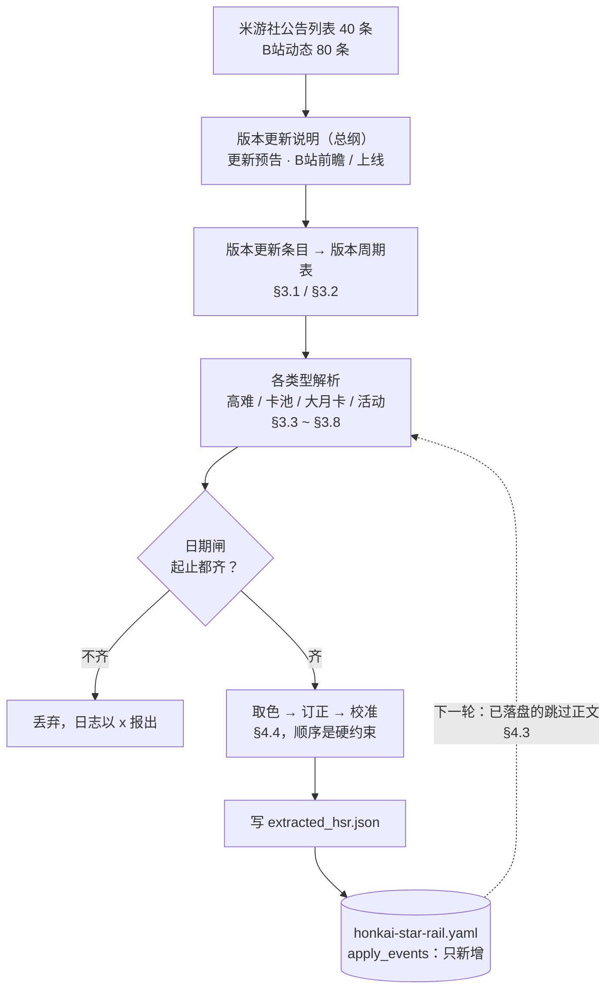

**没有状态文件**：`data/events/honkai-star-rail.yaml` 自己就是状态——下一轮的预筛（跳过谁）、
订正（补哪条）、版本周期表（从哪几个日期推）都从它读。图里那条虚线回环就是这个意思。

---

## 二、分类方法：一条公告属于哪一类

**先看 `subject`（标题），不看正文。** 只有「常规活动 / 版本大活动」的类型要读正文才定得下来
（§3.6），另有两种公告**不进日历但必须读正文**（版本更新说明、更新预告）。

### 2.1 判据表

| 类型 | 判据 | 日期来源 | 结果 |
|---|---|---|---|
| 版本更新说明（总纲） | 标题含 `版本更新说明`，且不含 `云•星穹铁道` | 正文 | 落本版 + 下版两条「版本更新」 |
| 更新预告 | 标题含 `更新预告` | 正文 | **不进日历**，只用来定版本更新日 |
| 卡池 | 标题匹配 `\d+\.\d+版本活动跃迁` | 正文 | 落「卡池」 |
| 大月卡 | 标题含 `无名勋礼` | 正文 | 落「大月卡」 |
| 常规活动 / 版本大活动 | 以上都不命中、不在 `EXCLUDE`、标题最外层能取出「名字」 | 正文 | 落「常规活动」或「版本大活动」 |
| 前瞻直播 | B站动态正文写「…前瞻特别节目将于…正式播出」 | 动态里那天 | 落「前瞻直播」 |
| 版本更新（B站上线） | B站动态正文写「X.Y版本「NAME」将于…上线」 | 动态里那天 | 落「版本更新」 |

两类**不是公告、由别的来源派生**：

| 类型 | 派生自 | 见 |
|---|---|---|
| 高难挑战（四支） | 版本更新说明的 `■玩法` 段 | §3.4 |
| 登录福利 | 总纲 `全新活动` 段里**没有 `活动时间：`** 的那条 | §3.7 |

### 2.2 排除词 `EXCLUDE`

命中即不当作「常规 / 版本大活动」。除上表已由各自解析函数处理的以外，还有一类是
**本就不该进日历**的：

- 账号封禁、商店上新、意见反馈、优化说明、已知问题、跃迁记录、小程序、云•星穹铁道
- 角色前瞻、光锥前瞻、更新电台、专题展示页、互动抽奖、联名、创作者激励
- **任务说明**（开拓任务的公告，「开拓任务」这个词未必在标题里）
- **赛季扩充**（常驻玩法的版本内更新）
- **权益升级**（《云•星穹铁道》的促销，崩铁侧也会发一条同名公告）
- **更新说明**（同一个常驻玩法的更新说明，这期标题从「赛季扩充说明」改叫「更新说明」）

> 上面加粗的四条都是**标题带「」、正文里却没有活动时间段**的公告：不列进名单就会被当成
> 活动，于是每轮白抓一次正文、又永远落不了盘（无日期被日期闸丢掉）。名单按标题措辞维护，
> 公告改名就拦不住新的叫法——补词经过见 [PLAN.md](PLAN.md) §4 的 2026-09-24 条目。
>
> ⚠️ `更新说明` 同时覆盖了 `版本更新说明`，但**版本族公告的安全不靠这个名单**：`is_activity`
> 先判 `is_version_notes` / `is_update_preview` / `is_banner`，而收集它们的 `find_version_notes`
> / `find_update_previews` / `find_banners` **根本不看 `EXCLUDE`**。所以往这里加词不可能
> 误杀版本更新、更新预告、卡池这三类。

### 2.3 分类决策树

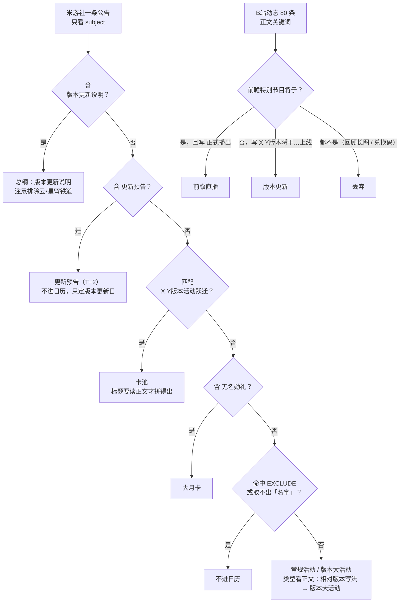

---

## 三、各类型的数据维护流程

### 3.1 版本更新

**来源**：版本更新说明（本版起止 + 下版本日期）、更新预告（T−2）、B站上线动态。

**日期**：三个来源按优先级覆盖同一个版本号——更新预告 > B站上线动态 > 版本更新说明。
本版日期由说明的「A 版本更新后」给出，下版日期由说明的末日期给出，版本号由 `+0.1` 预测
（跨大版本如 4.9→5.0 会猜错，靠 `keys` 的同类型 7 天兜底认回）。

**标题**：`《崩坏：星穹铁道》X.Y 版本「版本名」停服更新`；版本名还不知道时退化为
`《崩坏：星穹铁道》X.Y 版本停服更新` 并打 `待确认版本` 标签——说明是开服当天发的，此时
B站前瞻还没到，但下个版本的日子已经定了，值得先让日历显示出来。等更新预告 / B站上线动态
一到，`calibrate` 补全标题并摘掉标签（标题是 `VALUE_FIELDS` 之一）。

**身份**：主键 = (类型, 版本号)，不含日期——同一条版本更新会被反复校准。

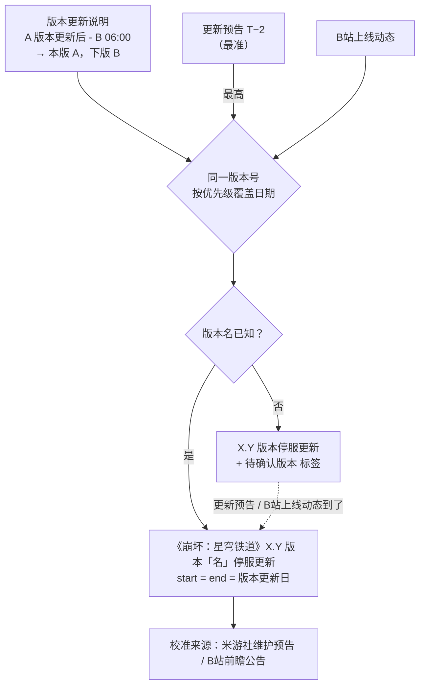

### 3.2 版本周期表

**不是条目，是一张派生表** `{版本号: (起, 止)}`，止 = 下一条的日期 − 1 天。它是所有相对
写法的地基：活动的「X.Y版本期间 / X.Y版本结束前」、高难「异相仲裁」的起止、总纲的
「X.Y版本更新后」都要查它。

**由版本更新条目推，不从说明正文重算**：条目标题里带版本号（`keys.version_of`），落盘并
校准之后版本更新日就是权威值。输入 = 数据文件里的版本更新条目 + 本轮候选（候选写在后面，
同名版本的旧值被覆盖，修正日期因此能生效）。口径与原神 `inference.extract_version_dates`
一致。

两条**假定**（不猜的具体含义）：

- 表内相邻即实际相邻——没落盘的版本不会出现在表里，也就不会被活动引用
- 最后一条的止是 `None`。星铁**不做 42 天那种兜底外推**（周期不固定），所以拿不到止的
  相对写法会被日期闸丢掉，而不是落一段错日期

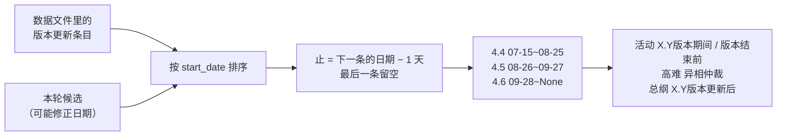

### 3.3 前瞻直播

**来源**：B站动态。**日期**：动态里写的那天，照抄（直播不是游戏内时段，不减一天）。
**标题**：`《崩坏：星穹铁道》X.Y 版本「版本名」前瞻特别节目`。**校准**：B站前瞻公告。

两个坑（都实测踩到过）：

- **闸门用「正式播出」而不是「开启」**：回顾长图动态里也有「开启」（「开启新的冒险旅途」），
  用「开启」会把回顾当预告，而且日期会取错（回顾里只有兑换码失效日）
- **动态条数 `DYN_LIMIT = 80`**：比原神宽，版本更新说明与前瞻预告都要留在窗口内

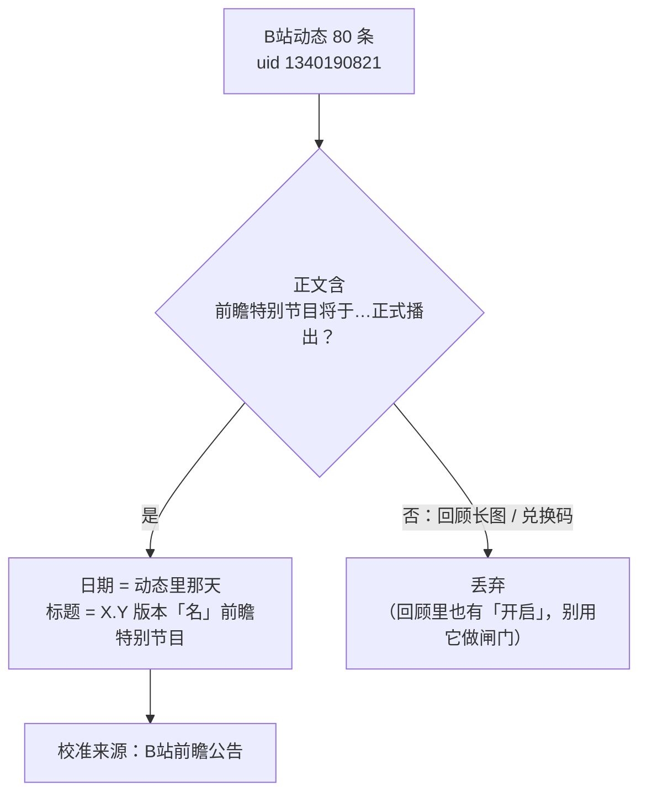

### 3.4 高难挑战

**来源**：版本更新说明的 `■玩法` 段（这一份本来就要读——总纲活动段与版本名也在里面）。
**四支**：异相仲裁 / 末日幻影 / 虚构叙事 / 混沌回忆。

**日期**：三支在段里自带起止，照抄（清晨时刻减一天，见 §4.1）；**异相仲裁只给期名**
（`●本期主题：「异相仲裁•军团再临」`），它的起止实测正好等于所在版本期间，查版本周期表补。

**标题**：`型名·期名`。**校准**：米游社版本更新说明——星铁的高难期名与日期都写在里面，
是这条管线里唯一的权威来源，而它恰恰是最容易错的一类（原神的高难无公告，对原神是空转）。

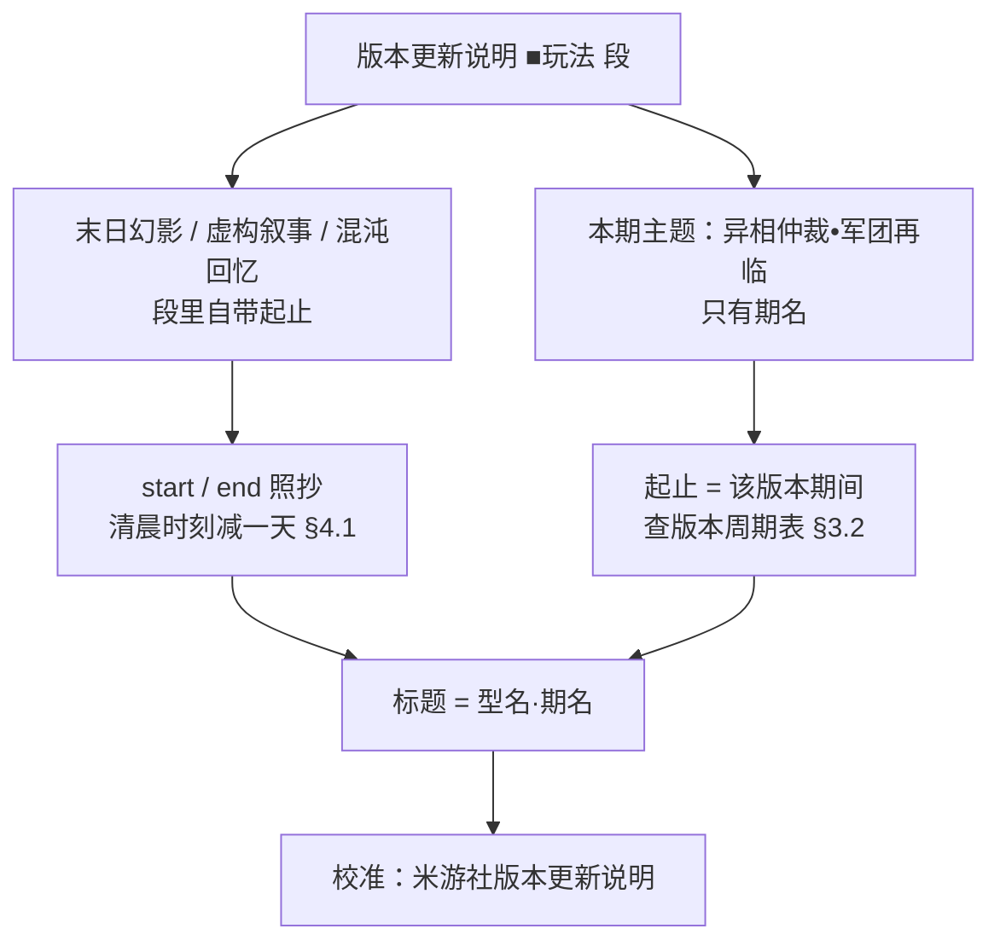

### 3.5 卡池

**来源**：标题匹配 `X.Y版本活动跃迁` 的公告。星铁卡池公告的标题只有「（其一/其二）」，
**5 星名全在正文里，标题必须现拼**——所以这一类**不预筛**（每版本 2~3 条公告，量很小）。

两种排版（都实测过）：

| 排版 | 做法 |
|---|---|
| 正文有 `本期活动跃迁时间为 A - B，包含如下内容` | 全公告共用一个时间段；5★ = 所有 `角色活动跃迁期间，限定5星角色「X」`（顺序去重）。其一/其二都是这种 |
| 没有该句（含「铭心之萃」返场池的排版） | 开头段落**逐句分组**，每句给出自己的一组 5★ 和 `跃迁时间为 …`。4.4 其二里返场池 8/05 开、首发池 7/15 开，必须拆成两条 |

**标题** = 该组的 5★ 用 `「」` 连起来 + `跃迁`。拼出的标题与数据文件里既有条目**逐字一致**
（selftest 断言），所以卡池不需要任何日期或标题推理——原神的 `inference.infer_banner_dates`
在星铁完全用不上。

**去重**：同一期卡池会在「其一」「其二」里各出现一次（姬子•启行整版都在池，两篇都写了它），
落盘前按 (标题, 起, 止) 去重。**身份**：主键 = 完整标题。

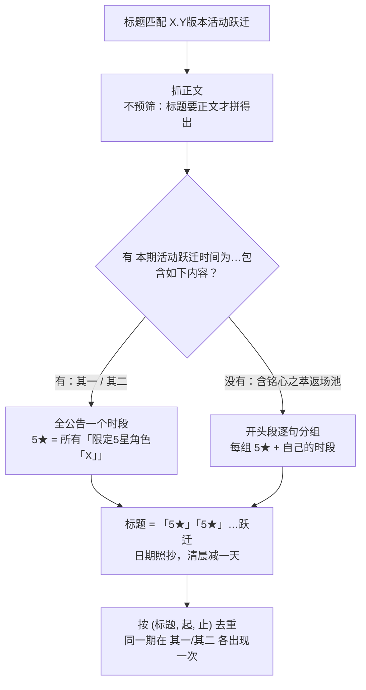

### 3.6 常规活动 / 版本大活动

两条路并行，最后按**身份**去重、留先出现的公告那条（它有真类型与描述，总纲那条只有默认类型）。

#### 3.6.1 按活动自己的公告落盘

一篇公告可能挂着**多条**活动（正文里每块用 `▌「X」活动说明` 标出自己的名字），所以逐块产出。
绝大多数公告一帖一活动：没有那种标题，整篇正文就是一块，名字取 `subject` 里最外层的「」。

| 时间段写法 | 结果 |
|---|---|
| 绝对日期 `A - B` | start / end 照抄，清晨时刻减一天（§4.1） |
| `X.Y版本期间` | 两端 = 该版本期间（**两端都取那一版**，不取段内日期） |
| `X.Y版本结束前` | 终点 = 该版本终点；起点 = 段内的绝对日期 |
| 只解得出 ≤1 个日期 | 判为**不齐**，留空 → 被日期闸丢掉 |

**类型**：时段挂在版本上的（前两种相对写法）→ `版本大活动`；其余 → `常规活动`。
**标题**：`「块名」`——分块后每块的名字就是它活动的名字（`「命运赠礼」`），不是拼
「主体名 + 块名」。标题是去重主键，拼法一改就插重复。

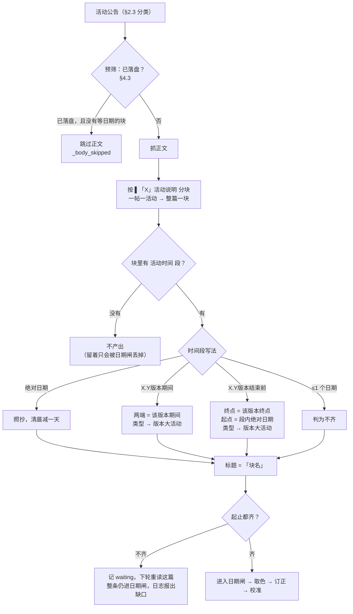

#### 3.6.2 按总纲提前落盘（「总纲优先」）

总纲的 `X、全新活动` 段逐条列出本版活动名与 `活动时间：`，**比活动自己的公告早约 15 天**
（4.5 总纲 08-26 发布，「方寸大冒险」的公告 09-10 才发）。所以这一段直接收进来，活动在版本
更新当天就挂上日历。

代价是总纲给不出**类型、配图、正文描述**——落盘时用默认类型 + `pending` 标记，等它自己的
公告发出来后由 `calibrate.correct_from_candidates` 补齐并清掉标记（§4.4）。

解析要点：段号每版不同（`六、` / `七、`…），按**后缀**「全新活动」定位，在下一个编号段处
截断；段内按 `■` 切条；条目名取到首个 `●`/`※`/空格。

**只收当前版本的那一份总纲**：窗口里通常还留着上一版的总纲，但它的活动要么已经落盘、
要么永远不会落盘；而从它产候选会插**重复**——同一个活动可能有两个名字，按标题去重认不出来
（实例见 [PLAN.md](PLAN.md) §4「2026-09-21 — 方案落地 + 数据订正 + 总纲优先」）。

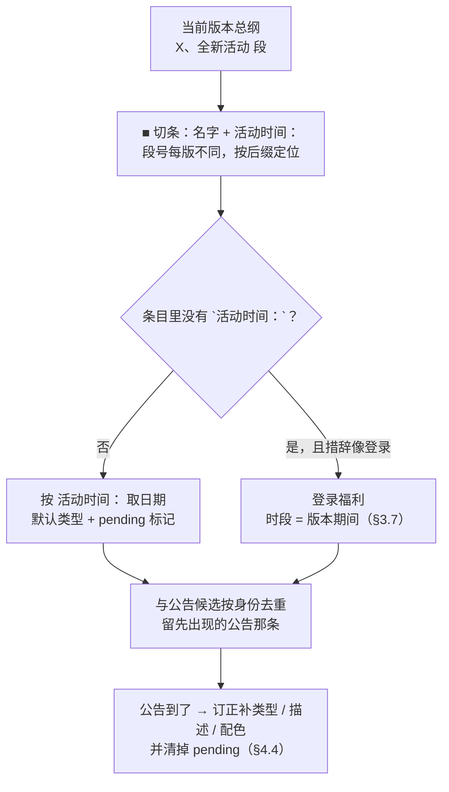

### 3.7 登录福利

`巡星之礼` 每版本都有，总纲里**没有 `活动时间：`**（写的是「活动期间，每日登录…」），
而它从来没有自己的公告——不就地收，就永远进不了日历。

**判据是条目本文里没有 `活动时间：`**，不是「日期解不出来」——两者必须分开：`命运契约•再启`
有 `活动时间：`（只是终点写作「4.6版本结束前」），它的时段不等于版本期间，给它套版本期间会
落一段错日期。措辞（`LOGIN_KEYWORDS`：每日登录 / 登录即可 / 累计登录 / 签到）作第二道确认。
**时段**取版本期间（起止都是总纲自己给的相邻更新日，不是外推）。

**不打 `pending` 标记**：标记是「等它自己的公告来订正」的开关，而它没有公告可等——打了标记
没人来清，会永久留在数据文件里。

> 已知取舍：`巡星之礼` 的真实领取窗口是 7 天签到（大约版本前半段），这里按整版显示。

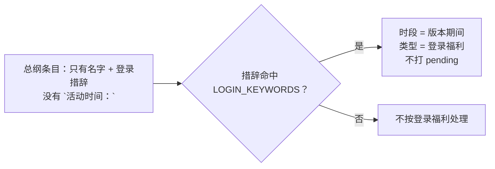

### 3.8 大月卡（无名勋礼）

**来源**：标题含 `无名勋礼` 的公告。走**同一道预筛**（已落盘就跳过正文，与卡池不同）。

**标题**：`X.Y版本「无名勋礼」`——期名每版本都一样，**必须带版本号**，否则去重键会撞
（两期只落一条）。**日期**：以大月卡自己公告的 `活动时间` 段为准。

> ⚠️ **无名勋礼在版本结束前就先结束**，它的结束日**不等于**版本期间终点。实测 4.4 版本
> 期间 7/15~8/25，而 4.4「无名勋礼」是 7/15~**8/23**。不要拿版本周期去套、也不要拿版本
> 期间去"纠正"它。

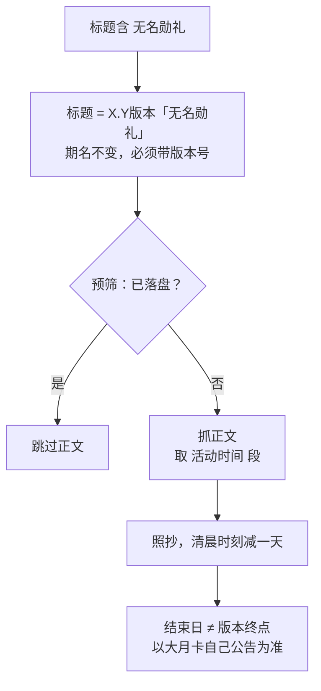

---

## 四、全局规则（所有类型共用）

### 4.1 时间与日边界

**结束时刻在清晨（≤ 06:00）→ 结束日减一天；白天时段（11:59 / 15:00）→ 照抄。**

06:00 是停机维护时刻、04:00/03:59 是游戏日分界，两者玩家都玩不到那一整天，所以都减；
11:59 / 15:00 是白天时段，照抄。实现见 `parse.parse_period`（`MORNING_CUTOFF_MIN = 6*60`）。

**起止的取法**：start = 时间段里**首个**日期，end = **末个**日期。`parse_period` 从整段文本
找日期，所以调用方必须先切出「只属于这一条」的那一段（`ACTIVITY_SECTION` 那一段、卡池的一句、
总纲的一条），否则会取到相邻条目的日期。

逐条核对表（10 条真实文本 → 推出 → 数据文件，全部与版本更新说明一致）见
[PLAN.md](PLAN.md) §4「2026-09-21 — 方案落地 + 数据订正 + 总纲优先」。

> 版本更新说明里的「持续时间为 … - 下版本日期 06:00」取**原始值**（9/28），不减一天
> ——它是下一版的起点，不是本版的终点（本版终点由版本周期表推，见 §3.2）。

### 4.2 标题与身份

| 类型 | 标题 |
|---|---|
| 常规活动 / 版本大活动 | `「活动名」`（取最外层「」，兼容嵌套） |
| 卡池 | 见 §3.5 |
| 版本更新 | `《崩坏：星穹铁道》X.Y 版本「版本名」停服更新`；版本名未知时 `…X.Y 版本停服更新` |
| 前瞻直播 | `《崩坏：星穹铁道》X.Y 版本「版本名」前瞻特别节目` |
| 大月卡 | `X.Y版本「无名勋礼」`（必须带版本号，见 §3.8） |
| 高难挑战 | `型名·期名`（如 `异相仲裁·军团再临`） |

**去重主键**（`common/keys.event_key`，与原神共用）：

- 常规活动 / 版本大活动 / 卡池 / 大月卡 / 登录福利 → **完整标题 + 开始日期**
- 版本更新 / 前瞻直播 → **(类型, 版本号)**
- 例外：双倍掉落类（`「位面分裂」`/`「花藏繁生」`/`「异器盈界」`）→ 标题 + 开始日期
  （`DATED_KEYED_PREFIXES`）。这三类每期标题**一字不变**，只认标题的话第二期会被当成重复
  条目静默丢掉

> ⚠️ **改标题 = 改身份**：标题就是去重主键，拼错一个字下一轮就插重复。所以 selftest 逐字
> 比对数据文件里既有的条目。

### 4.3 预筛与审读闸门（请求数的主控）

**米游社只有正文接口有风控**（`retcode 1034`），所以正文抓取次数是这条管线的关键指标，
两道闸都在压它：

**预筛 `_needs_body`**：已落盘的条目不必再抓正文（正文只用来取日期 / 描述 / 配图，都是
**新增**才需要的）。判定复用 `keys.find_duplicate` + `keys.likely_recorded`，因此不会比
`apply_events` 的去重更激进。`likely_recorded` 在候选侧拿不到日期，只能按标题认，再加一道
闸：**同名条目的开始日期不早于公告发布日**才算同一条（活动公告总在活动开始前发出，实测
20 条里 19 条如此，中位提前 2 天）。拿不准就返回 `False` 去抓正文——多一次请求可以接受，
漏一条不行。

**审读闸门（只给活动公告）**：一篇公告挂着多条活动（§3.6.1），而被埋的那条名字**不在公告
列表里**，不看正文就发现不了。所以**已落盘的活动公告也要读正文**，但不是每轮都读——审读时
逐块算日期，把「这篇还有没有块的日期解不出来」记进 `.cache/audited.json` 的 `waiting`：

| 上一轮的结果 | 这一轮 |
|---|---|
| 还有块在等版本周期表（`waiting`，如「幻造」里埋的「命运契约•再启」等 4.6 的止） | 再读一遍；那一版的日期一确认就落盘，随后自动转成跳过 |
| 全部块都落盘了 | **跳过，连 TTL 都不等** |
| 一条都没解析出来（格式变了 / 残页） | 记 `waiting`，下轮再看 |

判据是**派生的**（「这篇还有没啃下来的块」），不需要任何名单。大月卡 / 卡池那两条调用点
不带 `audit`（它们的正文里没有「活动」可漏）。

**正文缓存** `common/body_cache.py`：按 `post_id` 存正文，TTL 14 天。缓存目录
`tools/editor/.cache/`，**不进仓库**。为什么是 TTL 而不是永久（公告会被事后编辑）见
[PLAN.md](PLAN.md) §4「2026-09-22 — 一帖多活动 + 登录福利 + 正文缓存」。

### 4.4 订正与校准

**订正 `calibrate.correct_from_candidates(events, acts)`**：用本轮候选补已有条目——候选类型
有依据时写回 `type`；带 `pending` 的条目补 `description` / `color` 并清标记。**不动 id、
不动日期**，按**标题**匹配（要订正的恰恰包含类型本身，而 `VALUE_FIELDS` 走的是主键）。
只可能往「版本大活动」方向订正，反向被默认类型护栏挡住。

**校准 `calibrate.calibrate(events, sources)`**：用权威来源核对已有条目，只改值 + 打
`calibrated` 标记，不新增。星铁的权威来源：

| 类型 | 校准依据 | 标记值 |
|---|---|---|
| 高难挑战 | 米游社**版本更新说明**（唯一权威来源） | `米游社版本更新说明` |
| 版本更新 | 米游社维护预告（T−2）> B站前瞻公告 | `米游社维护预告` / `B站前瞻公告` |
| 前瞻直播 | B站前瞻公告 | `B站前瞻公告` |

**顺序是硬约束**（§1.2 的第 8~11 步）：

1. **日期闸 → 取色**：取色要给封面图发真网络请求（`pastel_from_url`），排在闸前等于给马上
   要丢掉的条目白下载一次
2. **取色 → 订正**：订正要补的「配色」正是取色的产物
3. **订正 → 校准**：两者都写 `events`，校准读的必须是订正后的结果；且版本大活动的**主键
   含类型**，类型改对了校准才查得到权威来源

### 4.5 风控与日志

日志按行读，先看这一行：

```text
== 正文抓取 == 成功 0 / 失败 0 / 缓存命中 9 / 跳过正文 9（已存在）
```

- **成功 / 风控**：`（其中风控 1034: N）`，非 0 就是被风控了。**别重跑**（反复重跑会加重），
  等冷却。风控期间正文大面积抓不到 → 条目缺日期被闸掉 → 本轮报「0 新增」，这是**假阴性**，
  别误当成「今天没有新活动」
- **跳过正文 N（已存在）**：预筛生效的条数，稳态下占绝大多数
- **`== 跳过（日期不完整）==`**：以 `x` 逐条报出缺日期的条目。它是缺口可见性的主要来源；
  带 `_body_skipped` 标记的条目不在这里报（它们没日期是正常的）

日志写在 `logs/YYYY-MM-DD.log`，多条管线按游戏分节。

---

## 五、附：与其它管线的差异

| 项 | 原神 | 星铁 |
|---|---|---|
| 段落标记 | `〓活动时间〓` | `▌活动时间` / `▌限时活动期` / `▌开启时间`（三种都用）；版更公告里还会标成 `■活动时间` |
| 卡池标题 | 标题自带卡池名 + 5 星（`「孤灯夜访」祈愿：「诡灯陌影·菲林斯(雷)」概率UP`） | 标题只有 `（其一/其二）`，**5 星名在正文里** |
| 卡池公告关键词 | `祈愿` + `概率` | `X.Y版本活动跃迁` |
| 大月卡 | 纪行（`XX纪行`，每版本名不同） | 无名勋礼（**名字永远一样**，需带版本号区分） |
| 维护预告 | `X.Y版本更新维护预告`，正文 `〓更新维护信息〓` | `X.Y版本预下载&更新预告`，正文 `列车组预计于 A 进行版本更新维护…更新至X.Y版本「NAME」` |
| 嵌套书名号 | `[「『]([^」』]{2,40})[」』]` 可用 | 该写法会把 `「镇伏『贪饕』，汇聚愿力」` 截断，必须用 `「([^「」]{2,60})」` |
| 版本周期 | 固定 42 天 | **不固定**（4.4→4.5 = 42 天，4.5→4.6 = 33 天），不能外推 |
| 周期性推理 | `genshin/inference.py`（高难无公告，只能推理） | 不需要——总纲给了下版本日期与高难四支 |
| 风控对策 | 同一条（见 [../genshin/RULES.md](../genshin/RULES.md) §4.6） | 同上，另有审读闸门（§4.3） |
