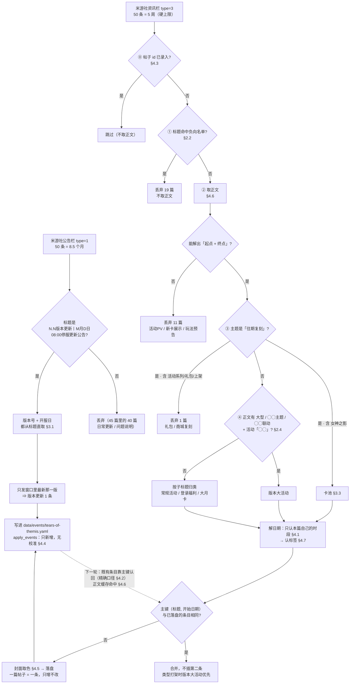
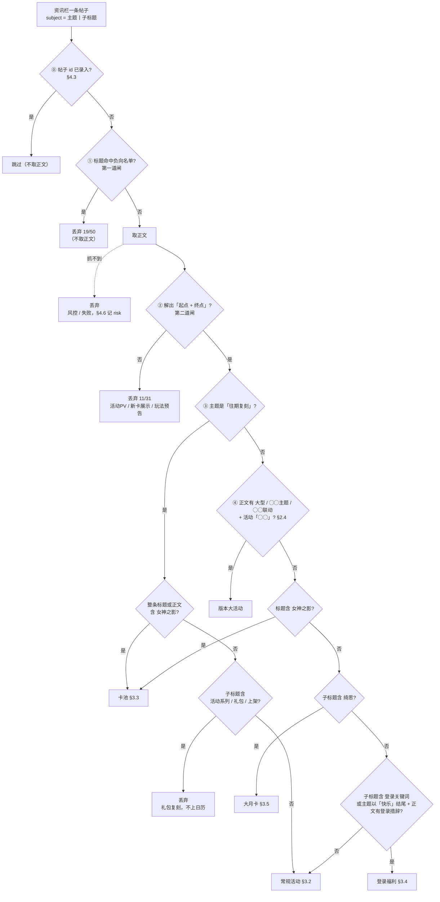
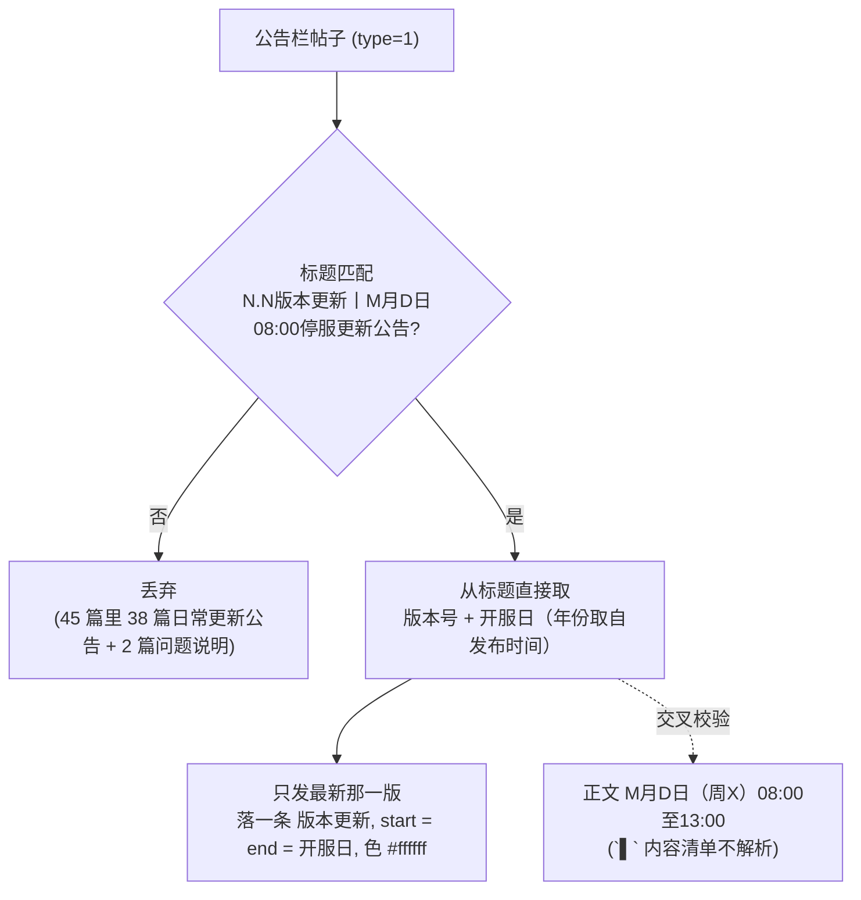
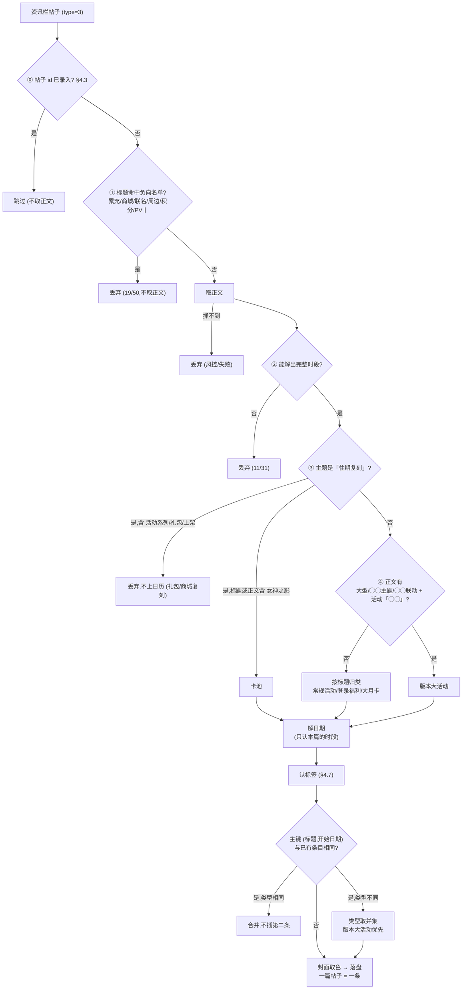
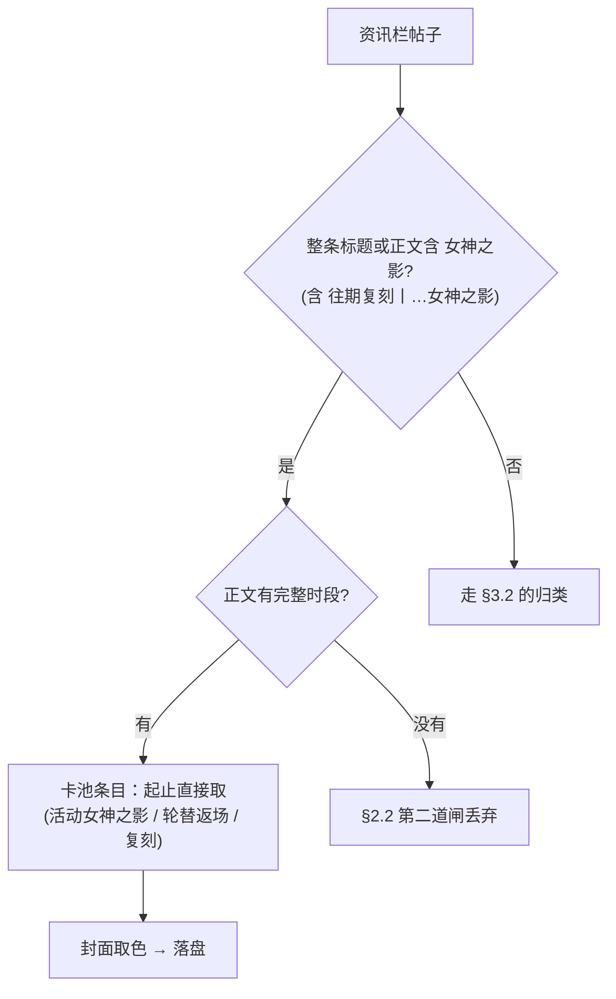
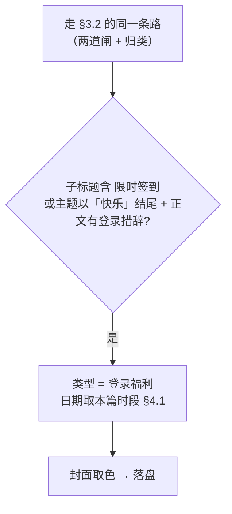
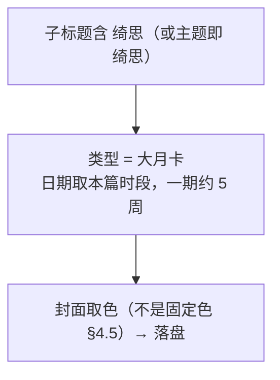

# 未定事件簿活动信息的提取与维护规则

> **状态：管线已实现并通过自检（2026-09-25）。**
> 代码在 `themis/`（`rules.py` 常量 / `parse.py` 解析 / `pipeline.py` 编排 /
> `selftest.py` 离线自检），实测抓取见 [PLAN.md](PLAN.md) §6。
> 本文的每条判据都有对应用例断言，改判据要连 `selftest.py` 一起改。
>
> 所有判据都来自 2026-09-25 的实测抓取（米游社 95 篇正文 + B站 90 / **500** 条动态）。
> 标 **🔒 已定** 的是已裁定的判据 —— 裁定清单（33 行）在 [PLAN.md](PLAN.md) §5，
> **已全部拍完**；本文正文里提到的「裁定 N」都指那张表（本文只写「怎么跑」）。
> 标 **⏳** 的是**派生要求**（由裁定推出来的实现约束，不是待拍板的决策点）。
> 文中凡写「实测」的数字，都能在 `selftest.py` 或 fixtures/ 里复现。

---

## 一、总览

### 1.1 数据来源

**主源：米游社。B站 不接入**（裁定于 2026-09-25，理由见本节末）。

| 来源 | 取法 | 一次性给出什么 | 窗口 |
|---|---|---|---|
| **米游社公告栏** | `fetch_post_list` `gids=4` `type=1` | 版本停服更新公告 → **版本号 + 版本开服日**（`▌` 内容清单**不解析**） | 50 条 ≈ **8.5 个月** |
| **米游社资讯栏** | 同函数 `type=3` | 活动公告主体（`主题丨子标题`） | 50 条 ≈ **5 周** |
| 封面图 | `common.colors.pastel_from_url` | 除版本更新外所有类型的浅色（见 §4.5） | — |
| ~~B站官方动态~~ | ~~`bilibili.fetch_dynamics`~~ | 🔒 **不接入**：与米游社逐字同源，无额外信息 | 90 条 ≈ 57 天 |

三点与另三端不同的地方：

- **活动信息在资讯栏，不在公告栏。** 公告栏里只有运维帖（日常更新公告、停服更新、
  未成年人限时通知、问题处理说明），资讯栏才是活动。
- **`getNewsList` 无法翻页**（`last_id` 返 0 条，`offset` / `page` 被忽略；
  `page_size` 传 100 会**静默回落成 20 条**）⇒ **50 条是硬上限**。资讯栏发帖密
  （50 条只有 5 周），**首次回填装不下一个版本周期**（约 42 天，且有 70 天的异常，见 §4.4）。
- **B站 官方动态（UID `436175352`）不接入**：与米游社**逐字同源**（对上的文本差异只有
  B站 的前缀 `#未定事件簿#【子标题】` 与尾部一行 `※点击查看…↓↓↓`），且**没有 `subject`
  字段**（`主题丨子标题` 只能从正文 regex 抠）。它窗口深（90 条 = 57 天 ≥ 一个版本周期），
  但这只对**一次性**的首次回填有价值，不值得为它常驻第二个解析器 —— 需要补历史时可
  临时借用。对比数据与过程见 [PLAN.md](PLAN.md) §4「补测：B站 动态对比」。

### 1.2 一轮顺序（已实现）

```
公告栏 → 版本表（版本号 → 开服日，从标题直取）→ 只发最新那一版
资讯栏 → ⓪ 已录入的帖子按 id 跳过（不取正文，§4.3）
       → ① 标题负向名单（丢 19/50，不取正文）
       → ② 取正文 → 解不出完整时段就丢（再丢 11）
       → ③ 复刻二分（活动系列/礼包/上架 → 丢 1）
       → ④ 正文复合标签（大型/主题/联动 → 版本大活动）
       → 分类 → 解日期（日期只认本篇自己的时段）→ 打标签
                                    ↓
         去重（同名同期合并；类型打架时版本大活动优先）
                                    ↓
                     取色 → 落盘（只增不改，无校准）
```



> ⚠️ **这一段的顺序与三端不同**：未定**没有「订正 → 校准」两步**（不接 `calibrate`，裁定 19），
> 所以「取色 → 落盘」直接接在去重之后 —— 三端那边的「日期闸 → 取色 → 订正 → 校准」硬约束
> 在这条线上不存在（理由与代价见 §4.4）。

分流实测（`selftest.py` 的 `test_collect`）：**50 → ① −19 → ② −11 → ③ −1
⇒ 19 条候选 → 去重 17 条 + 版本更新 1 条 = 18 条**（≈ 3.6 条/周，逐篇清单见 PLAN §6.2.1）。

⓪ 在上面两步**之前**、按**帖子 id** 判（§4.3）：数据文件里已有条目对应的帖子直接跳过，
不取正文。它省的是正文请求，**也**可能让候选少几条 —— 命中几篇只取决于数据文件里已录入
多少条，随每轮落盘增多；少掉的正是已录入的那些，落盘结果不变（`apply_events` 本来也会
跳过它们）。各轮实测数见 [PLAN.md](PLAN.md) §4。

**落盘粒度：一篇帖子 = 一条**（去重后）。`丨` 前的 `主题` **不是**管线的必要环节，
只用于人读与去重判断 —— 日期一律来自本篇自己的时段，不从兄弟帖回填（见 §2.3）。

两个实例（判据的作用面）：`岁悦同欢·莫弈篇` 一期 3 篇 → **2 条**
（生日拼图 9/17 / 生日活动 9/20）；`NXX-非常假日` 8 篇 → **1 条**（签到；
主活动在窗口内没有任何带结束日的帖子，见 §3.2）。

---

## 二、分类方法：一条帖子属于哪一类

### 2.1 标题的固定形状

资讯栏的标题一律是 **`主题丨子标题`**（竖线是半角 `丨`，U+4E28）：

| 主题（`丨` 前半段） | 子标题例子 |
|---|---|
| `NXX-非常假日` | 全新活动玩法，共度荒岛时光 |
| `岁悦同欢·莫弈篇` | 莫弈生日活动预告 / 全新莫弈生日SSR思绪【挚礼】 |
| `轮替女神之影更新` | 夏彦SSR【夏花永隽】限时返场 |
| `往期复刻` | 「心有所欲」活动限时复刻 |
| `插画分享` | 夜阑梦隐，晨光可期 |

**⚠️ 关键：`丨` 前的主题是「所有」资讯栏帖的命名法，不是活动的标记。**
`插画分享` / `商城上新` / `会员积分活动` / `主线更新` 也都长这样。
所以 **主题既不能用来分类，管线里也不需要拿它分组** —— 分类看子标题与正文，
日期看本篇自己的时段（见 §2.3）。

另有少数没有 `丨` 的：公告栏的 `《未定事件簿》M月D日游戏日常更新公告`、
`N.N版本更新丨…停服更新公告`（主题即版本号）、周边/联名的整句式标题。

### 2.2 分类决策树（三道预筛闸 + 两次归类）

**三道闸的顺序很重要：先看帖子 id，再看标题，最后才取正文。** ⓪ 已录入的帖子按
**帖子 id** 跳过（判据与代价见 §4.3）；① 只看标题就能再判掉 19/50 篇。
两者加起来省掉 21 次正文请求（未定正文接口虽然目前不风控，但没理由白花）。



> 节点顺序即 `parse.classify` 里的判断顺序。**最后一档是「常规活动」兜底**（`classify`
> 不返回 `None` —— 丢不丢由①②两道闸在前一步决定）。判据文字见本节下面四关，
> 各类型的落地流程见 §三。

**第一道闸：标题负向名单 —— 非游戏内内容，不取正文即丢。**（🔒 已定）

| 关键词 | 实例 | 理由 |
|---|---|---|
| `日常更新公告` | 《未定事件簿》9月23日游戏日常更新公告 | 每周运维帖 |
| `未成年人` | 2026年中秋节及国庆节假期未成年人游戏限时通知 | 政策通知 |
| `问题处理说明` | 低于Android 9版本安卓设备启动时闪退问题处理说明 | 修 bug |
| `插画分享` `OST` `捐赠证书` `PV丨` | 插画分享丨时移日转 | 宣传、公示 |
| `未定事件簿×`（联名） / `周边` / `手办` / `盲盒` / `预售` | 未定事件簿×茉酸奶丨… / 「1/8可替换头部配件手办…」 | 实体或站外促销 |
| `会员积分` | 会员积分活动丨第十五期… | 米游社商城活动，不在游戏内 |
| `商城上新` | 商城上新丨「枫院秋晖」背景礼包限时折扣上架 | 纯商城折扣，无活动玩法 |
| `限时累充` | NXX-非常假日丨限时累充活动预告 **（带完整时段，但不上日历）** | 促销，非活动玩法 |
| `系统更新` | 「逸梦」系统更新丨全新梦笺即将上线 | 常驻系统更新 |
| `主线更新` | 主线更新丨主线第二十章《枯荣之间》现已更新！ | 版本内容，不是限时活动 |

⚠️ **不要把 `快乐丨` 放进名单。** `中秋快乐丨…` 和 `教师节快乐丨…`
带游戏内登录奖励，是**登录福利**（2026-09-25 裁定），不是宣传帖。

> `限时累充` 是名单里**唯一「带完整时段仍要排除」**的 ——
> 光靠第二道闸拦不住它，必须留在名单里。

**第二道闸：正文里解不出完整时段就丢。**（🔒 已定）

未定的帖子有相当一部分只是「展示」：活动 PV、新卡展示、玩法预告，
它们只有一句宣传语，没有可落日历的日期。这些帖的共同特征是
**解不出「起点 + 终点」**。

判据是「能否解出完整时段」，而不是「有没有某个关键词」——所以**用户点名要排除的四类
全部落网**，只是落点不同：活动PV / 新卡展示 / 玩法预告 是**这道闸**丢的
（下面 14 篇清单里都能找到）；累充预告带完整时段，是**第一道闸的名单**丢的。

**实测漏斗（资讯栏 50 篇 = 5 周）：**

| 步骤 | 剩 |
|---|---|
| 资讯栏 50 篇 | 50 |
| ① 标题负向名单丢弃 | **19** |
| ② 取正文（31 篇）→ 无完整时段丢弃 11 篇 | **20** |
| ③ 复刻里含「活动系列/礼包/上架」再丢（§第三关） | **19** |
| ⇒ **候选** | **19** |
| 去重（同名同期合并，见本节末） | **17** |
| ＋公告栏的版本更新（只发最新一版） | **18**（≈ 3.6 条/周） |

> 表里的 31 篇是**过闸后全部取正文**的离线口径（`test_collect` 不传 `existing`）。
> ⓪ 预筛（已录入的帖子不取正文）不在表内：窗口内它把正文请求从 31 减到 29、
> 候选从 18 减到 17（少的是已录入那条，落盘结果不变，§4.3）。

② 丢掉的 11 篇（原样抄录，这是判据的作用面）：

```
NXX特别调查丨限时活动预告 全新拼图【春知】开放获取
爱的未定式·夏彦篇丨全新夏彦SSR思绪【换日线】
星航寻梦丨全新左然MR思绪【幻航】
枯荣之间丨全新陆景和SR思绪【片言】
岁悦同欢·莫弈篇丨全新莫弈生日SSR思绪【挚礼】
岁悦同欢·莫弈篇丨限时活动现已开启
活动前瞻丨「NXX-非常假日」活动即将开启！
NXX-非常假日丨活动限定夏彦SSR思绪【惟愿得偿】
NXX-非常假日丨活动限定左然SSR思绪【听海】
NXX-非常假日丨活动限定莫弈SSR思绪【屿间歌】
NXX-非常假日丨活动限定陆景和SSR思绪【我心遥遥】
```

> 这 11 篇里 6 篇是**卡面展示/玩法预告**、5 篇是同一期 `NXX-非常假日` 的碎片帖
> —— 判据是「能否解出完整时段」，不是关键词名单，所以它们全都自然落网。
> ⚠️ `教师节快乐丨春风化雨，桃李芬芳` **不在这 11 篇里**：它的时段行是裸的
> `▶2026年9月10日00:00-9月12日23:59`（无 `活动时间：` 标签），解析器同时认
> **带标签** 与 **裸 `▶日期`** 两种写法（见 §4.1），所以它是候选、归登录福利。

**第三关：复刻要二分。**（🔒 已定）

`往期复刻丨…` 这个主题下混着两种东西，**必须再分**：

| 命中 | 归到 | 实例 |
|---|---|---|
| **`女神之影`** | **卡池**（正常上日历） | 往期复刻丨「NXX-冰原上的审判」活动女神之影限时复刻 |
| **`活动系列` / `礼包` / `上架`** | **排除，不上日历** | 往期复刻丨「NXX-冰原上的审判」活动系列、往期复刻丨往期绮思限定甜心服饰常驻上架短笺兑换所 |

「活动系列」复刻是**礼包复刻**（卖东西），不是可玩的限时活动。`上架`
（2026-09-25 新出现的一篇补进来的）同理：那篇正文通篇是礼包上架与兑换所，没有玩法；
它主题是 `往期复刻`，所以躲过了第一道闸的 `商城上新`。

⚠️ **卡池信号取「整条标题或正文」，不只取子标题**（2026-09-25 实测）：

| 帖子 | 信号在哪 | 判定 |
|---|---|---|
| `轮替女神之影更新丨夏彦SSR【夏花永隽】限时返场` | 主题里 | 卡池 |
| `换日线丨活动女神之影开启 夏彦SSR【换日线】概率提升` | 子标题里 | 卡池 |
| `往期复刻丨莫弈生日系列限时复刻` | **只在正文里**（正文通篇女神之影，两段不同时段的卡池） | 卡池 |
| `往期复刻丨「濯影拾辉」活动限时复刻` 等 3 篇 | 标题与正文**都没有** | 常规活动 |

实测资讯栏 50 篇里标题含 `女神之影` 的 4 篇**全是卡池、零假阳性**，另 3 篇复刻帖
正文 0 次命中（逐篇见 PLAN §4）。⚠️ 别放宽成 `女神之`：`女神之泪` 是道具，满屏都是。

**第四关：正文里的复合标签 → 版本大活动。**（🔒 已定，判据见 §2.4）

先查正文有没有 `〔修饰语〕活动「活动名」` 且修饰语是 `大型〈季节〉` /
`〈◯◯〉主题` / `〈◯◯〉联动`；命中即**版本大活动**，否则再按子标题归类。

**再分类**：

| 未定叫法（子标题里的字） | 归到项目类型 | 正文里有日期吗 |
|---|---|---|
| 正文有 `阿加莎联动活动「何人生还」` 这类复合标签 | **版本大活动** | **有** |
| `限时活动预告` `限时活动开启` `活动玩法` `活动前瞻` | **常规活动** | 预告/开启帖有，玩法帖没有 |
| `限时签到预告` / `限时签到活动` | **登录福利** | **有** |
| 节日祝福类带登录奖励（`中秋快乐` `教师节福利`） | **登录福利** | **有** |
| `活动女神之影开启` `轮替女神之影` `限时返场` | **卡池** | **有**（`▶活动时间`） |
| `往期复刻丨…活动女神之影…` | **卡池** | **有** |
| `全新绮思丨「XX绮思」` | **大月卡** | **有**（50 / 78 元两档，同星铁「无名勋礼」） |

**去重规则：完全重复的活动直接跳过；类型打架时版本大活动优先。**（🔒 已定）

复刻帖与本体帖会有完全同名同期的条目（如「心有所欲」本体与复刻），
比对 `(标题, 起止)` 完全相同即跳过，不插第二条。
实现落在 `pipeline._merge`：按**主键**（标题, 开始日期）合并候选，再去
`apply_events` 与数据文件比对。实测 19 条候选合掉 2 条：
`岁悦同欢·莫弈篇` 的「预告」与「福利」两篇同时段 → 1 条；
`爱的未定式·夏彦篇` 的「限时活动预告」与「全新动态邀请函」两篇同时段 → 1 条。

⚠️ **例外**：同一个活动往往有多篇帖子带**完全相同的时段**，而**只有其中几篇**带版本
大活动标签（`「何人生还」` 3 篇时段都是 `7月15日11:00-8月2日04:00`，带标签的那篇
不是手工 yaml 引的那篇）。单纯「跳过」会让**保留哪篇、类型就取哪个**取决于处理顺序
⇒ 结果不定。所以重复帖之间 **类型取并集，版本大活动优先**（`_merge` 里显式判
`e["type"] == "版本大活动"`，落盘时 apply_events 只插第一条，所以「留哪篇」
就等于「类型取哪个」）。实测过程见 PLAN §4。

### 2.3 主题（`丨` 前缀）的用途

**主题串只用于人读与去重的辅助判断，不是管线的环节。** 日期一律来自**本身带完整时段
的那篇帖**，其余的直接丢（§2.2 第二道闸），**不从同主题的兄弟帖回填** —— 管线不建
任何分组机制。

一个活动常被拆成多篇，各篇的日期完整度不同。`NXX-非常假日`（9/30 开启）两天内发了
8 篇：`活动前瞻` / `全新活动玩法` / 3 篇卡面展示 / `活动PV` 都**没有结束日**，
带完整时段的只有 `限时签到`（独立成条）与 `限时累充`（被名单排除）
—— 所以这一期落盘的只有签到 1 条，主活动本身要等下一条带完整时段的公告。
`岁悦同欢·莫弈篇` 更极端：**预告帖带完整时段**，正式帖（`限时活动现已开启`）反而没有。

⇒ 「按主题分组、组内谁有 `▶活动时间` 就用谁」这种补日期法会产出**日期取自别的帖**的
条目，与裁定 6（一篇帖子一条）、裁定 9（落不了就等）相抵，**已经推翻**。
推翻过程与当初为什么觉得需要它，见 [PLAN.md](PLAN.md) §4。

### 2.4 派生判据（尽量不建名单）

1. **版本开服日**：来自公告栏的停服更新公告 —— **版本号取自标题** `N.N版本更新丨M月D日08:00停服更新公告`
   （标题里版本号与日期都现成，**不用取正文**）；标题没有年份，年份取自**发布时间**，
   12 月发的公告写「1月X日」时 +1 年。这是**唯一权威的版本锚点**。
   🔒 已定：**公告栏只取这两样，`▌` 内容清单不解析** —— 它对分类没什么用，
   粒度粗到把商城折扣、首充重置都包进去。
   🔒 已定：**只发窗口里最新那一版**（窗口里躺着 5 份停服公告，全发等于一次性
   回填 4 个历史版本，与裁定「首次回填 = 不补」相抵）。
2. **`M月D日更新后`**：活动帖里的相对措辞，只出现在**起点时刻**的位置
   （`2026年9月30日更新后-10月18日04:00`），**日期部分照抄即可，不做换算**
   —— 未定正文里的终点一律带明确时刻（实测 95 篇里唯一的相对写法就是「更新后」，
   且都只写在起点），所以**不需要**原神那套 `resolve_version_starts` 版本表换算。
   ⚠️ 相应的一个限制：起点写「更新后」的帖子若**终点也缺席**，就解不出时段、
   被第二道闸丢掉（`NXX-非常假日` 的碎片帖就是这么丢的），这是预期行为。
3. **版本大活动 vs 常规活动**：🔒 **已定 —— 认官方自己贴的「复合标签」**
   （2026-09-25 验证并裁定）。

   正文里出现 **`〔修饰语〕活动「活动名」`** 这个句式，且修饰语属于：

   | 修饰语 | 实例 |
   |---|---|
   | `大型〈季节〉活动` | 大型新春活动「故城长燃的薪火」（5.6） |
   | `〈2–6 字〉主题活动` | 萌兽学院主题活动「萌兽在校生」（5.8）、海岛主题活动「NXX-非常假日」（6.1） |
   | `〈2–8 字〉联动活动` | 阿加莎联动活动 / 六周年阿加莎联动活动「何人生还」（5.9） |

   ⇒ **版本大活动**。修饰语是 `限时`（限时活动「心跳低喃时」）或 `◯◯生日`
   （左然生日活动「予爱未名·左然篇」、莫弈生日活动「岁悦同欢·莫弈篇」）⇒ 常规活动。
   **修饰语本身就是分类器。**

   **实测（332 天全库 = B站 500 条动态，2025-10-28 ~ 2026-09-25）**：复合标签**只命中
   这 4 个活动，零假阳性、一句一期** —— 正好是版本大活动的真实频率（6 版里 4 版有，
   5.7 与 6.0 没有，不是漏抓）；`「何人生还」` 的官方标签与手工 yaml 的 `tags: 联动`
   对上。四个活动与时段见 PLAN §6.6。

   被实测否掉的另外四个候选（`▌` 内容清单 / 奖励三件套 / 时长更长 / 正文「分阶段」）
   及推演过程见 [PLAN.md](PLAN.md) §4。⚠️ 时长只能当复核，**不能当判据**
   —— `邂逅幻梦` 是 24 天的常规活动。

   ⚠️ **两个实现要求**：

   1. **标签只在正文里，标题没有。** 米游社的 `subject` 是
      `何人生还丨活动预告 参与活动获得徽章…`，不含标签。好在第二道闸本来就要取正文。
   2. **重复帖之间类型会打架，去重必须带 tie-break**（见 §2.2 去重规则）。

---

## 三、各类型的数据维护流程

> 流程图与实现一一对应：节点顺序 = `parse.classify` / `pipeline.collect` 里的判断顺序，
> 落盘字段见 `pipeline.OUT_FIELDS`。

### 3.1 版本更新（公告栏）



公告栏里的非版本帖（日常更新公告、问题说明等）**全部靠标题丢弃**，不用取正文
—— 窗口内 45 篇里只有 5 篇是版本停服更新公告。

### 3.2 活动（常规 / 版本大活动 / 复刻）



🔒 **版本大活动落不了是预期内的**（裁定 9/10）：主活动要**等下一篇带完整时段的公告**
（活动开启后 / 即将结束）才能落地，此前不插半条数据、不落 `pending`（§4.3）。
窗口内的实例见 §2.3。

### 3.3 卡池（女神之影）



⚠️ **没有「思绪帖」这道判据**：新卡展示帖（`…活动限定夏彦SSR【惟愿得偿】`）正文里
本来就没有完整时段，第二道闸已经全部拦下；而带完整时段的思绪帖
（`轮替女神之影丨莫弈SSR【莫负良辰】限时返场`）本来就该是卡池，单独挡反而会漏。
所以判据只留一条：**有完整时段才进候选**。（草案里那条已删，见 PLAN §4）

实测两种卡池的日期来源：
- **活动卡池**：`换日线丨活动女神之影开启 夏彦SSR【换日线】概率提升` → `2026年9月3日11:00-9月10日04:00`
- **轮替返场**：`轮替女神之影更新丨夏彦SSR【夏花永隽】限时返场` → `2026年9月18日11:00-10月2日11:00`（结束时刻是 `11:00`，见 §4.1）
- **复刻卡池**：`往期复刻丨莫弈生日系列限时复刻` → 正文两段不同时段的卡池，取**第一段**（§4.1）

🔒 **卡池的身份带开始日期** `(类型, 标题, 开始日期)`（2026-09-25 裁定 18，见 §4.2）：
未定的卡池会**返场**，三端那种不带日期的主键会把返场静默跳过。标题侧的 `限时复刻`
后缀（裁定 32）只把**首开与复刻**两期分开，**分不了轮替池的各期**（每期都是返场、
每期都带后缀）—— 分期仍然只靠开始日期。

### 3.4 登录福利（限时签到 / 节日福利）

与常规活动同一条路，只是类型不同：

- `邮轮之旅前音丨限时签到预告` → `2026年9月24日11:00-10月18日04:00`
- `中秋快乐丨佳节长相伴，今宵共团圆` → `2026年9月25日00:00-9月27日23:59`（🔒 已定算登录福利）
- 同类还有 `教师节福利`（`2026年9月10日00:00-9月12日23:59`）

注意节日福利这条的**起始时刻是 `00:00`**（落在 04:00 游戏日边界之前）——
§4.1 的 start 规则是「直接抄」，这里同样照抄，但**实盘抽查时要特意看一眼这条**。



### 3.5 大月卡（绮思）

`全新绮思丨「秋颂绮思」正式上线` → `2026年9月10日11:00-10月15日04:00`，
**封面取色**（§4.5），与星铁「无名勋礼」同类。一期长约 5 周（绮思周期，不是版本周期）。



---

## 四、全局规则（所有类型共用）

### 4.1 时间与日边界

未定正文**没有 `〓〓` 段名**。三种写法都要认：

```
▶活动时间：2026年9月15日11:00-9月20日04:00            ← 主流
※活动时间：2026年9月23日20:00—2026年10月12日23:59     ← 全角破折号
▶2026年9月10日00:00-9月12日23:59                      ← 裸日期，无「活动时间：」标签
```

第三种是 `教师节快乐` 那类**节日福利帖**的写法（95 篇里命中 1 篇）。
只按 `活动时间：` 去匹配会把它漏掉 —— 实测就是被 §2.2 第二道闸误杀的那一篇。

| 情形 | 做法 |
|---|---|
| **start_date** | 开始时刻所在日，**直接抄**（`11:00` / `20:00` 都落在当天 04:00 之后） |
| **end_date = `04:00`** | **减一天**。`04:00` 是游戏日重置点，那一刻归次日，最后一个完整游戏日是前一天 |
| **end_date = `11:00` / `23:59`** | **直接抄**，不减（落在当天 04:00 之后） |
| **终点省略年份** | 用起点的年份；若终点月份 < 起点月份，跨年 +1 |

> 与原神口径同源：原神把「结束于 04:00 重置点」写成 `03:59` → `-1` 天；
> 未定写 `04:00` → 同样 `-1` 天。**同义不同写法**，别照抄那边「只有 03:59 才减」的字面。
> ⚠️ **手工录入最容易漏的就是这一步**：2026-09-25 拿正文核对手工 19 条，
> 窗口内 12 条可核对的**有 6 条错**（3 条是 `…04:00` 结尾没减一天，3 条数量级错误），
> 均已按正文订正，明细见 [PLAN.md](PLAN.md) §4「核对手工数据日期」。

- **一篇可能有多段时段**：复刻帖常见两段（活动本体一段、兑换所一段）。取**第一段**
  当活动时段（`PERIOD_RE.search` 只找第一处），其余留作参考。实测两段日期相同的居多，
  不同时以第一段为准。
- **分隔符只认 `-` `–` `—`（半角连字符 / 短破折号 / 全角破折号），故意不认 `至`**：
  实测 `至` 的 3 次命中全是假阳性（`将于 1月6日10:30 左右进行更新` 之类），
  没有一次是真的 `A日至B日` 时段。
- 相对措辞 `M月D日更新后`（如 `9月30日更新后`）：**日期照抄，不换算**（§2.4-2）。

### 4.2 标题与身份

- 🔒 **标题取「活动名」，不取整条 `主题丨子标题`**（2026-09-25 裁定）。
  已验证不会因此产生重复条目（26 条候选内部零同名；与手工 19 条的 4 处疑似碰撞
  逐条核过，**全都是同一个活动** —— 见 [PLAN.md](PLAN.md) §4）。取法按手工数据现成的惯例：

  | 类型 | 取法 | 例子 |
  |---|---|---|
  | 卡池 | `角色 + 稀有度 + 【思绪名】` | `夏彦SSR【换日线】`、`莫弈SSR【挚礼】` |
  | 活动 / 登录福利 / 大月卡 | `「」` 内的主题名 | `「青葱寄愿」`、`「星航寻梦」` |
  | 复刻 / 返场 | 同上 + `限时复刻` 后缀（**引号外面**，见下条） | `「濯影拾辉」限时复刻` |

  ⚠️ **`丨` 前缀不是活动名，是栏目名**，不能直接拿来当标题：

  | 栏目名 | 窗口内出现 | 该栏目下真正的名字 |
  |---|---|---|
  | `往期复刻` | 3 | `「濯影拾辉」` / `「NXX-冰原上的审判」` / `「心有所欲」` |
  | `轮替女神之影`（含「更新」变体） | 2 + 1 | 子标题里的 `角色+SSR【思绪名】` |
  | `商城上新` | 2 | `「枫院秋晖」` / `「莫弈·挚礼」`（前一条已被名单丢掉） |
  | `岁悦同欢·莫弈篇` | 2 | `「岁悦同欢·莫弈篇」`（生日活动本体）+ `…生日拼图`（后缀，见下） |

  （B站 侧没有这个选择 —— 它连 `subject` 字段都没有，见 §1.1。）

  取法在 `parse.title_of`：复刻帖收掉子标题末尾的官方套话再接后缀（见下条）、
  卡池取 `CARD_TITLE_RE` 命中的 `角色+稀有度+【思绪名】`（找不到就退回子标题）、
  其余取子标题里第一个 `「…」`（取不到退回主题，`「星航寻梦」` 这种主题即活动名的就对）。
  ⚠️ 卡池**不去正文里找**思绪名：正文里冒出的是**别的**卡池的思绪名，取到就张冠李戴。

- 🔒 **手工 19 条已与管线取法对齐**（2026-09-25 落地）。改了 3 条标题：
  `「星航寻梦」-左然MR【幻航】` → `「星航寻梦」`、`NXX特别调查-主线第二十章` →
  `「NXX特别调查」`、`「岁悦同欢·莫弈篇」生日活动` → `「岁悦同欢·莫弈篇」`。
  对齐后 18 条候选里 **8 条新增、10 条跳过**（`test_matches_existing` 锁住）。

- 🔒 **同一期活动的两篇帖子：靠后缀把两条分开**（2026-09-25 裁定「有生日拼图四个字时
  加上这四个字，其他情况遇到再补充」）。`「岁悦同欢·莫弈篇」` 这一期由两篇帖子组成 ——
  生日拼图（9/17~9/24）与生日活动本体（9/20~9/29），**两条同名的话日历上看不出区别**，
  所以主题兜底取标题时，子标题里命中 `rules.TITLE_SUFFIX_WORDS` 的词接到标题后面：

  | 帖子子标题 | 取到的标题 |
  |---|---|
  | `生日拼图限时活动预告` | `「岁悦同欢·莫弈篇」生日拼图` |
  | `免费获取多重生日限定福利` | `「岁悦同欢·莫弈篇」`（不加） |
  | `莫弈生日活动预告` | `「岁悦同欢·莫弈篇」`（不加） |

  取法在 `parse.title_of` **主题兜底那一支**（标题是从主题抄来的，正说明子标题里没有
  「活动名」可抄 —— 缺什么补什么；卡池与复刻帖的标题本来就抄自子标题，再补会重复）。
  派生结果与手工那条**逐字相同**，两边不用互相迁就。
  ⚠️ 名单是**逐例补充**的，不是通用判据：要通用就得解析 `<短语> + 公告套话`
  （`限时活动预告` / `限时活动开启`），那又得维护一份套话词表，而且猜错名字比同名更糟。
  没命中的新子活动只表现为**同名**（不再丢数据，见下条），确认过再往名单里加一行。

- 🔒 **复刻 / 返场帖的标题统一收成「活动名 + 限时复刻」**（2026-09-25 裁定 32）。
  范围是**往期复刻 + 轮替返场**两类，后缀接在活动名后面、**引号外面**；子标题末尾的
  官方套话先收掉：

  | 帖子子标题 | 收掉的套话 | 取到的标题 |
  |---|---|---|
  | `「濯影拾辉」活动限时复刻` | `活动限时复刻` | `「濯影拾辉」限时复刻` |
  | `「NXX-冰原上的审判」活动女神之影限时复刻` | `活动女神之影限时复刻` | `「NXX-冰原上的审判」限时复刻` |
  | `夏彦SSR【夏花永隽】限时返场` | `限时返场` | `夏彦SSR【夏花永隽】限时复刻` |
  | `莫弈生日系列限时复刻` | `限时复刻`（收完只剩主题名） | `莫弈生日系列限时复刻`（原样 + 后缀） |

  两个作用：**日历上要一眼看出这是复刻，而不是又一个新活动**；顺带让首开那一期与复刻
  那一期的标题不同。判据见 `parse.is_reprint` —— 只看**栏目**（`往期复刻` /
  `轮替女神之影`）与子标题里的 `限时返场`，**不看正文**：窗口内 7 篇复刻 / 返场帖的信号
  都在这两处，而正文里提「复刻」的只有其中 5 篇，多这一层来源不多认出一条，却给标题
  （去重主键的一部分）多添一处判据。
  ⚠️ **它不解决轮替池的分期**：轮替池每一期都是返场、每期都带这个后缀，标题仍逐字相同
  —— 分期靠的还是开始日期（见下条）。

- ⚠️ **日期兜底的两种口径：宽（三端 ±7 天）/ 精确（未定）**

  `keys.find_duplicate` 在主键（标题, 开始日期）失配后，还会比一遍有没有条目
  「认得出是同一事件」。它存在的原因是**日期是可以被改写的值**：订正过的日期会让
  带日期的主键失配，没有兜底就会插一条重复。口径按端点分
  （`keys.EXACT_FALLBACK_GAMES`），判据的出处是两条结构性差异：

  | 口径 | 端点 | 判据 | 为什么是这个判据 |
  | --- | --- | --- | --- |
  | 宽（默认） | 三端 | 同类型 / 同名 + 日期相差 ≤7 天 | 日期会被 `calibrate` 自动改写，改写幅度不限 |
  | 精确 | 未定 | **同名同起日**，或**同源帖** | 不接校准（§4.4）；一篇公告至多落一条条目 |

  「同源帖」= 候选的 `post_id` 与条目的 `source_url` 指向同一篇公告。人工订正日期是在
  **那篇帖子产出的条目**上做的，帖子 id 必然对得上 —— 这条把兜底真正要防的场景
  （订正后重跑）精确接住了，不需要窗口。

- 📌 **为什么未定不借 ±7 天那个窗口**：窗口的假阳性会**静默吞掉一条活动**，精确口径的
  假阴性只是多一条**可见的**重复 —— 两个方向不对等，所以取窄。踩到的正是
  `岁悦同欢·莫弈篇` 那两条（9/17 与 9/20 只差 3 天，旧口径下 9/17 那条会落不了盘），
  推演与新旧口径的逐候选对照见 [PLAN.md](PLAN.md) §4 最上面那条。

  代价明说：**人工改了起点日、条目又没有 `source_url` 时，重跑会插一条可见的重复**
  （删一次即可）。实测数据里 6 次人工订正**全是 end_date**、起点一次没改过，
  所以当前数据上这个代价是 0（`test_identity` / `test_matches_existing` 锁住新口径）。

- 身份（`common.keys.event_key`）：
  - 活动类（常规活动 / 登录福利 / 网页活动）→ `(标题, 开始日期)`，**沿用三端**。
  - 🔒 **卡池 → `(类型, 标题, 开始日期)`，带上日期**（2026-09-25 裁定）。
    理由：未定的卡池会**返场**，`轮替女神之影丨莫弈SSR【莫负良辰】限时返场` 这类
    帖子日后同一思绪再次返场时**标题逐字相同**；三端的卡池主键 `(类型, 完整标题)`
    **不含日期**，会把返场静默跳过。手工数据里 `「NXX-冰原上的审判」限时复刻`
    （卡池，8/27）就是这个风险已经踩到边界的例子。
  - ✅ **已落地**：主键一带日期，**手工订正日期就会打破主键**，所以卡池也必须进兜底 ——
    `find_duplicate` 的兜底原本被 `etype not in ANNOUNCEMENT_ACTIVITY_TYPES` 挡在卡池
    之外，未定侧已对它开放（`common/keys.py` 的 `DATED_BANNER_GAMES`）。
    至于兜底用什么判据，见上一条（未定走精确口径：同名同起日 / 同源帖）。
  - 手工 19 条的 `id` 形如 `tea-何人生还` / `tea-邂逅幻梦莫弈-活动`，与管线生成的
    `gi-常规-2026-11-绮衣珍赏晴暖` 不同；主键本来就不用 `id`，所以能对上。
    （**本轮只改了标题、没改 `id`**：`id` 是前端「已完成」追踪键，改了会清掉已有勾选。
    `auto_id` 只对新插入的条目生效，手工条目的 `id` 与标题不一致不影响去重。）

### 4.3 预筛与 `pending`

分类侧的两道闸（①②）已经在 §2.2 讲完；本节说另外两件事：**已录入的帖子直接跳过**（⓪），
以及 `pending`（`common.keys.PENDING_FIELD`）。

**⓪ 已录入就跳过 —— 按帖子 id 认，不按标题认。**（🔒 2026-09-25 裁定 33）

`collect(..., existing)` 先算一遍 `{keys.post_id_of(e)}`（条目的 `post_id`，或从
`source_url` 里解析出的米游社文章 id），命中的帖子**不取正文**，判定表里记 `跳过 / 已录入`。

另三端按**标题**认（`keys.likely_recorded`），未定这条路走不通：候选侧此刻手里只有
`主题丨子标题`，条目侧存的是 `title_of` 推出来的活动名，离线阶段两边对不上；放宽成
「主题在条目里出现过」又会踩未定特有的坑 —— 实测有同名不同期的活动（主题
`岁悦同欢·莫弈篇` 下既有 9/17 的生日拼图也有 9/20 的活动本体），误判一次就是**静默少
一条**。帖子 id 没有这个问题：`collect` 一篇帖子至多产出一条候选，条目与帖子因此一对一。

**代价说清楚**：某期活动若**只有一篇**帖子（且已录过），它的候选**不再产出** —— 与
`apply_events` 的「已存在就跳过」等价（条目已经在文件里了），不丢数据；但**数据文件侧的
标题从此不会被管线重算**。所以本轮给复刻帖加后缀时，已有的两条复刻条目是**手工同步改的**
（§4.2 裁定 32），不是靠重跑覆盖的。反过来，条目一删，下轮帖子就不再被跳过，照常重新产出。

**省下来的是正文请求**。认得出「已录入」的先决条件是条目带帖子 id：手工那批大多没有，
管线自己落的条目**都带 `source_url`**，所以命中率随轮次涨上来 —— 正文请求正是这条线最该
省的地方（§4.6）。

🔒 **版本大活动不落 `pending`，直接不落**（2026-09-25 裁定）：`NXX-非常假日` 的 8 篇里
根本没有结束日可等，落一条只有 `start` 的半条数据没有意义 —— 预期行为就是等下一篇
带完整时段的公告（活动开启后 / 即将结束）。只有玩法帖、没有带时段的帖 → 同样
**先不落**，下一轮再看。

**代价要先说清**：绝区零已经出现过一次「`pending` 摘不掉」（公告滑出窗口后没人来清），
未定资讯栏窗口更短（5 周）、问题只会更严重，所以能不用就不用。

实现上更彻底：`pipeline.OUT_FIELDS`（交给 `apply_events` 的字段白名单）
**根本没有 `keys.PENDING_FIELD`** —— 未定这条线连写 `pending` 的能力都没有。

### 4.4 订正与校准

🔒 **未定不接 `common.calibrate`，没有校准机制**（2026-09-25 裁定）。
管线**只增不改**：落盘后日期不再被任何自动流程改写，要改只能人工手改 YAML。
两个直接后果：

- 带日期的身份是**稳的**（没有自动改写来打破主键）—— 卡池身份因此可以带日期（§4.2）。
- 反过来说，**人工订正**是唯一能改日期的途径，所以 §4.2 的日期兜底是必需的 ——
  而且正因为日期不会被自动改写，未定那一侧可以走**精确口径**（同名同起日 / 同源帖），
  不用三端那个 ±7 天窗口。

版本周期**不能外推**：实测 37 / 42 / **70** / 42 天（5.6→5.7→5.8→5.9→6.0），
其中 5.8→5.9 隔了 70 天 —— 只能等版本停服更新公告，不能写死 42 天。

### 4.5 颜色

🔒 **只有「版本更新」是固定色 `#ffffff`，其余全部走封面取色**
（复用 `common.colors.pastel_from_url`；2026-09-25 裁定）。取不到封面时落
`rules.FALLBACK_COLOR`（`#f4dee1`）。

| 类型 | 颜色来源 |
|---|---|
| 版本更新 | 固定 `#ffffff`（`rules.COLORS`，与三端的停服更新同色） |
| 版本大活动 / 大月卡 / 卡池 / 常规活动 / 登录福利 | 封面图取浅色 |

理由：手工数据里那两条本来就不统一（版本大活动 `#bc5454` 深红、大月卡 `#f7eddb` 浅色），
而原神/星铁的版本大活动本来就一直是取封面色 —— 没有理由在未定单立一个固定色。

⚠️ **版本更新条目没有封面**（它来自公告栏，`images` 为空），所以固定色不是可选项，
是它唯一能有的颜色；其余条目若封面也取不到，退到 `#f4dee1`。

### 4.6 风控与日志

与三端同一条策略（cookie、`retcode 1034`、缓存、少请求）。风控的表现是**结果变少**，
不是报错（那篇 1034 的帖子本来也解不出时段），但**日志里必须看得出是「风控」而不是
「今天没有新活动」**：

- `pipeline.FETCH_STATS` 单独记 `risk`（正文失败且错误串含 `1034`）与 `cache`
- 日志行 `== 正文抓取 == 成功 N / 失败 N（其中风控 1034: N）/ 缓存命中 N`
- 风控**不抛异常、不退出非零**（「不用大声报错」）：本轮条目变少，下一轮再来

正文缓存（`common.body_cache`）在这条线上收益最大：未定一期的公告帖动辄十几篇
（`NXX-非常假日` 8 篇），判据又必须取正文，缓存命中能省掉大半请求。

### 4.7 标签（`tags`）

🔒 **自动打标**（2026-09-25 裁定「通过正文关键词来检测」）。未定手工数据里的 tags
只有三样，三样都能从抓到的文本里认出来，所以**不建任何标签名单**：

| 标签 | 词表 | 判据 |
|---|---|---|
| 男主名 | `夏彦` `左然` `莫弈` `陆景和` | 文本包含 |
| 稀有度 | `SSS` `SSR` `MR` `SR` | 正则，`(?<![A-Z])…(?![A-Z])` 卡边界 |
| `联动` | — | 文本包含 |

- **顺序**：四人按官方固定顺序（夏彦→左然→莫弈→陆景和），稀有度排在名字**后面**
  —— 与最新三条手工条目（陆景和SSS / 夏彦SSR / 莫弈SSR）一致。
  （手工里 3 条旧条目是「稀有度在前」的旧惯例，与新的不一致；
  管线一律名字在前，`test_tags` 交叉验证时**只比集合不比顺序**。）
- **来源顺序：标题命中就不看正文**。标题是「这篇指向谁」（`夏彦SSR【夏花永隽】限时复刻`），
  正文是上下文 —— 轮替返场帖的正文会把整个轮替池的角色列一遍，只看正文会把两条
  轮替帖打成四人全中（实测正是如此）。标题一个标签都认不出时才退到正文：
  复刻帖标题只有活动名（`「濯影拾辉」限时复刻` 的左然 MR 只在正文里）、
  七夕/多人活动也只有正文才有名字。
- **不建名单的另一半理由**：男主与稀有度是游戏自己的固定词表，不是会过期的活动名单
  （原神那种 `限时剧情奖励` 未定没有）。
- **不落空的标签**：认不出就写 `[]`（`apply_events` 只写非空 tags）。

`test_tags` 拿 19 条手工数据交叉验证：标题能对上的 10 条候选，标签集合**逐字相同**
（手工缺 `tags` 键 = 无标签）。这条断言是这套判据的守卫 —— 改 `HEROES` / `RARITIES`
的顺序或来源顺序都会在这里翻红。

### 4.8 描述（`description`）

🔒 **未定的活动描述一律留空**（2026-09-25 裁定，`pipeline.OUT_FIELDS` 里没有这个字段）。
理由：未定正文里混着大量礼包/兑换所/抽奖样板文字（商城帖 800+ 字），
照抄进 `description` 只是噪声；手工那 19 条里也有一半是空着的。
等想清楚「描述该存什么」再补。

---

## 五、附：与其它管线的差异

未定是**第四条线**，与三端（原神 / 星铁 / 绝区零）差异最大的几点
（[../starrail/RULES.md](../starrail/RULES.md) §五 有原神 / 星铁那份逐项对照，
这里只列影响未定自己的）：

| 项 | 未定 | 意味着什么 |
|---|---|---|
| 数据源 | 活动在**资讯栏** `type=3`，版本停服公告在**公告栏** `type=1` | 三端活动都在公告栏；未定**两个栏目都要抓**（§1.1） |
| 窗口 | 资讯栏 50 条 = **5 周**，`getNewsList` **不能翻页** | 比一个版本周期（约 42 天）还短；`pending` 摘不掉的风险更高（§4.3） |
| 标题结构 | `主题丨子标题`，`丨` 前缀是**栏目名**不是活动标记 | 三端是纯标题；未定取标题要剥栏目名，且分类不能看主题（§2.1 / §4.2） |
| 段落标记 | **没有 `〓〓` 段名**：`▶活动时间：` / `※活动时间：` / 裸 `▶日期` | 原神 `〓活动时间〓`、星铁 `▌`、绝区零 `【】`（§4.1） |
| 落盘粒度 | **一篇帖子一条** | 星铁要分块（一帖多活动）、绝区零总纲一篇落多条；未定反过来是**一个活动拆多篇**（§2.3） |
| 预筛口径 | **已录入的帖子按 `post_id` 跳过**（不取正文） | 三端按标题认（`likely_recorded`）；未定的候选标题从来不是条目名（§4.3） |
| 总纲 / 校准 | **都没有**（不接 `common.calibrate`，裁定 19） | 管线只增不改，落盘后日期只能手改 YAML（§4.4） |
| 卡池 | 标题取 `角色+稀有度+【思绪名】`，复刻 / 返场**另接 `限时复刻` 后缀**；身份**带开始日期**（会返场） | 三端卡池主键不含日期；未定返场时标题逐字相同（§4.2） |
| 大月卡 | 绮思（**每期名不同**） | 与原神「纪行」同类，主键可用完整标题；星铁 / 绝区零每期同名，得带版本号 |
| 高难挑战 | **没有**（类型词表减项） | 原神幽境危战有公告、星铁有权威公告、绝区零靠期数网格（裁定 17） |
| 版本周期 | 37 / 42 / **70** / 42 天，**不能外推** | 原神固定 42 天可外推（§4.4） |
| B站 | **不接入**（与米游社逐字同源，且没有 `subject` 字段） | 三端都接了 B站 作为补充来源（§1.1） |
| 日期兜底口径 | **精确**：同名同起日 / 同源帖 | 三端是 ±7 天宽口径，因为它们的日期会被 `calibrate` 自动改写（§4.2） |
| 正文缓存 | 已接 `common.body_cache` | 原神侧还没接；未定一期动辄十几篇同主题帖子，收益最大（§4.6） |

一句话记法：**未定是四条线里唯一「只增不改」的**（没有校准、没有总纲、不接 B站），
所以它的身份与兜底判据都比三端更依赖**帖子自己**——标题、`post_id`、本篇自己的时段。
