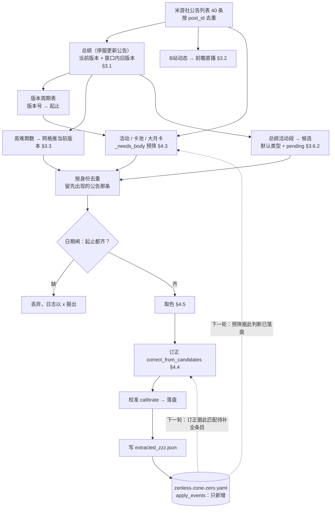
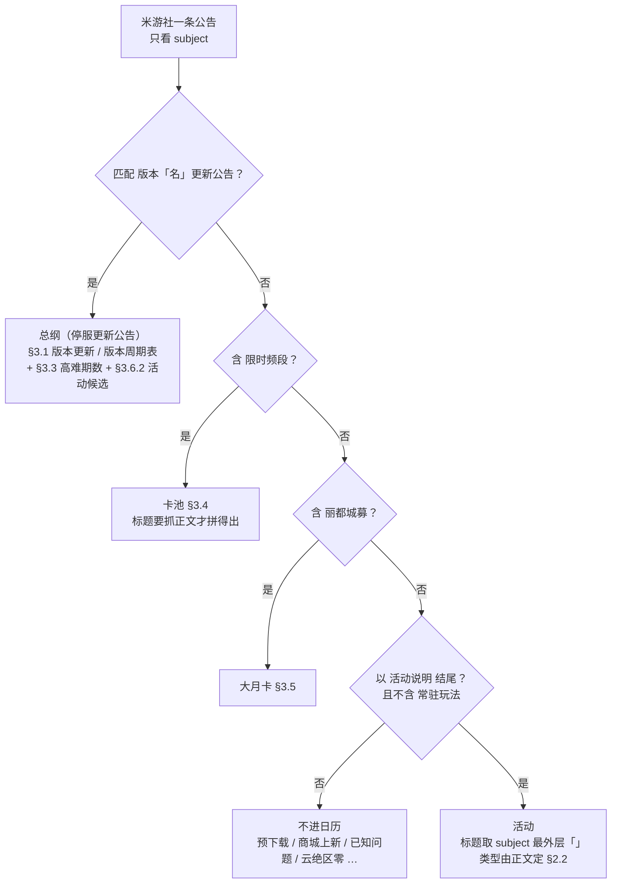
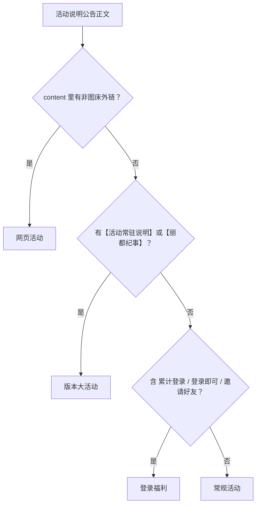
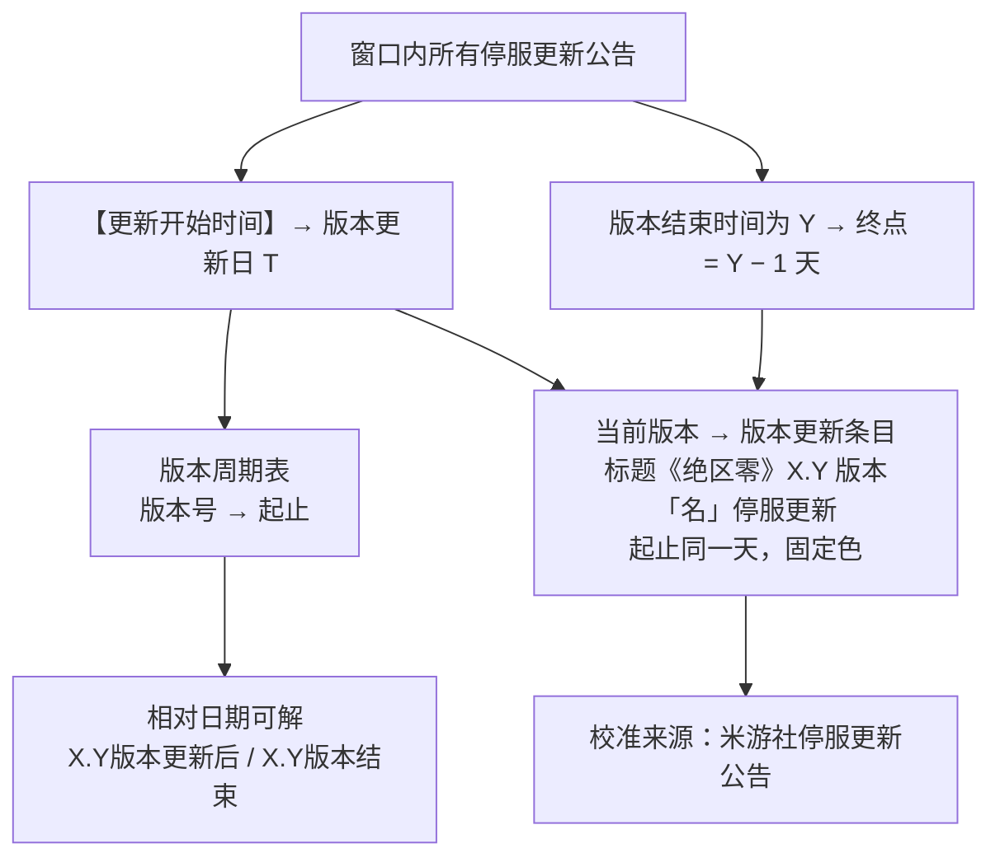
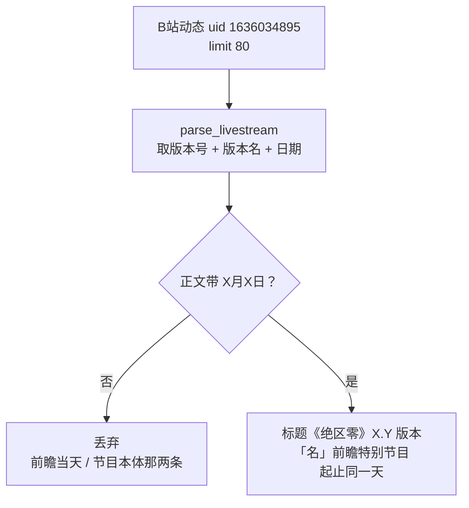
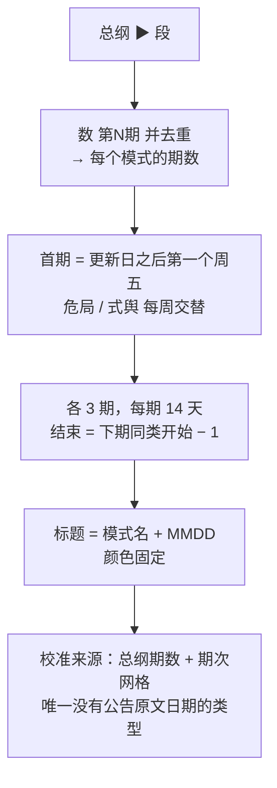
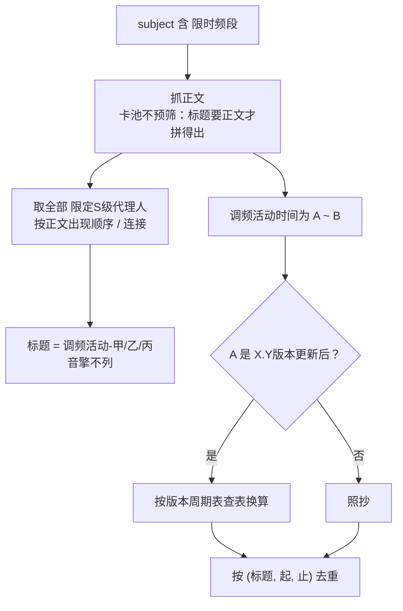
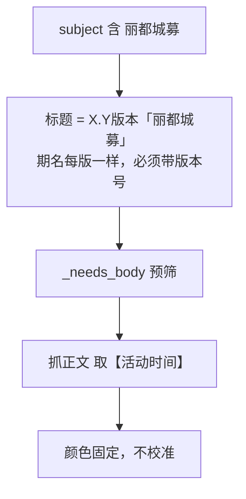
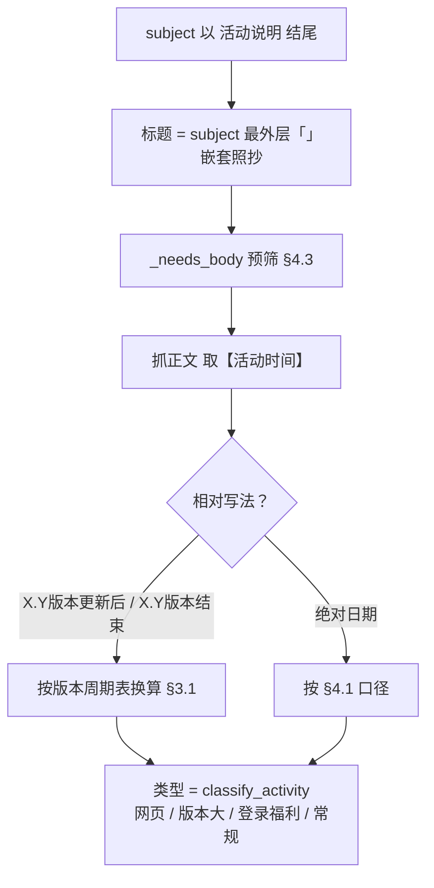
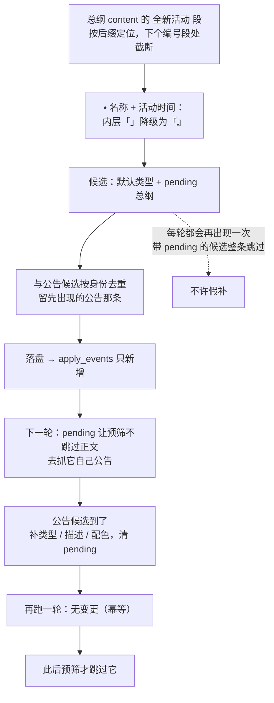

# 绝区零活动信息的提取与维护规则

本文只讲**管线怎么跑**：一条公告怎么被分类，每一类活动怎么把自己的日期、标题与身份定下来。
现状与已完成 / 未完成清单见 [PLAN.md](PLAN.md)；去重主键与校准的共用机制见
[../common/keys.py](../common/keys.py) 与 [../common/calibrate.py](../common/calibrate.py)；
其余各端的规则在各自目录的 `RULES.md`（本端与它们的差异见 §五）。

> **绝区零的信息结构最省事**：每版本开服当天发的**停服更新公告**是一份
> 完整**总纲**——版本名、本版起止、下个版本的日期、本版全部活动的起止、高难期数，全在一篇里。
> 它的**版本边界由公告明写、不用任何外推**：原神靠 42 天周期锚点推，
> 星铁靠相邻更新日相减，绝区零直接抄公告里的「X.Y版本结束时间为 …，该版本共持续42天」。
>
> 下面每条规则都用真实公告核对过，核对样本在 `fixtures/`（由 [selftest.py](selftest.py)
> 逐条断言，255 项）。

---

## 一、总览

### 1.1 数据来源

| 来源 | 位置 | 给出什么 |
|---|---|---|
| **米游社公告栏** | `fetch_post_list(page_size=40)`，按 `post_id` 去重 | 全部内容：总纲（停服更新公告）、活动说明、限时频段、丽都城募 |
| **B站官方账号动态** | `fetch_dynamics(uid=1636034895, limit=80)` | **只用来拿前瞻直播**——实测 B站动态正文与米游社公告**逐字相同**，其余一律走米游社 |

40 条覆盖约 **56 天**，窗口里同时留着两份总纲（当前版本 + 上一个版本）——活动日期大量写成
`X.Y版本更新后` / `X.Y版本结束`，**要按版本号查表**，旧的总纲也得在。

### 1.2 一轮的顺序

`python maintain.py`（四端一起跑），或单跑 `python zenless/pipeline.py`：

1. 抓米游社公告列表（40 条），按 `post_id` 去重
2. **抓总纲**（窗口内所有停服更新公告）→ 版本周期表 `{版本号: (起, 止)}` + 当前版本那份 +
   每份的正文 HTML
3. 抓 B站动态 → 前瞻直播
4. **活动**：两个来源并列 —— ① 各自公告（`_build_activities`，标题取自 subject、类型与日期
   出自正文）；② 总纲的 `X、全新活动` 段（`_activities_from_notes`，只有名字与日期，
   落默认类型 + `pending` 标记）。两份候选按身份去重、**留先出现的公告那条**（信息更全）
5. **卡池**（限时频段正文拼标题）、**大月卡**（丽都城募）、**高难**（按期数网格推当前版本）、
   **版本更新**（当前版本那份总纲）
6. 打印 `== 正文抓取 ==` 小结
7. **日期闸**：缺起止的条目丢弃，日志以 `x` 报出（`_body_skipped` 的不报，它没日期是正常的）
8. **取色**
9. **订正** `correct_from_candidates`（改类型 / 补描述与配色 / 清 `pending`）
10. **校准** `calibrate`（权威值 = 总纲版本更新日 + 网格高难 + B站前瞻），有变更即落盘
11. 写 `zenless/extracted_zzz.json` → `apply_events` 只新增



**没有状态文件**：`data/events/zenless-zone-zero.yaml` 自己就是状态——下一轮的预筛（跳过谁）
与订正（补哪条）都从它读。图里两条虚线回环就是这个意思。

---

## 二、分类方法：一条公告属于哪一类

分类全部**按标题（subject）**，不看正文：

| 顺序 | 类型 | 判据（常量） | 由谁处理 |
|---|---|---|---|
| 1 | 版本更新（**总纲**） | subject 匹配 `\d+\.\d+版本「[^」]+」更新公告`（`VERSION_NOTES_PATTERN`） | `find_version_notes`，**每轮都抓、不预筛** |
| 2 | 卡池 | subject 含 `限时频段`（`BANNER_KEYWORD`） | `find_banners` |
| 3 | 大月卡 | subject 含 `丽都城募`（`BATTLE_PASS_KEYWORD`） | `find_battle_passes` |
| 4 | 活动 | subject 以 **`活动说明` 后缀**结尾（`ACTIVITY_SUFFIX`） | `find_activities` |
| 5 | 其余 | 预下载、商城上新、已知问题、云·绝区零、主线剧情… | 不用处理，自然落空 |

**为什么用后缀而不是排除名单**：绝区零的活动公告一律是「`「活动名」活动说明`」，这是个**格式
约定**——排除名单会过期，而写新公告的人不会通知我们。实测被它挡掉的 5 种非活动写法见
[PLAN.md](PLAN.md) §4 的 2026-09-21「方案落地 + 数据订正」。

`EXCLUDE = ["常驻玩法"]` 是**第二道**保险：常驻玩法开启不录入（只值得记一次，且不在总纲的
「全新活动」段里、拿不到日期）。后缀判据已能挡掉现有写法，加词面是为防将来换个写法
（如「X」常驻玩法开启**活动说明**）悄悄混进来。

> ⚠️ 注意 `《云·绝区零》3.2版本更新说明` 与本体总纲 `3.2版本「NAME」更新公告` **只差几个字**，
> 靠 `VERSION_NOTES_PATTERN` 的「`版本「名」更新公告`」结构区分——别把正则放松成「含 `版本更新`」。

**`预下载` 通知不解析**：它给的 `【预下载时间】` 是 T−2，版本终点只说「截止至X.Y版本结束前」
**不给日期**。版本更新日只有一个权威来源，两个能对上的来源不值得多一条解析路径。

### 2.1 分类决策树



### 2.2 活动内部的四种类型（派生判据，不是名字名单）

一条活动公告落到哪种类型，按下面的**顺序**判（先命中先定）：

| 顺序 | 类型 | 判据 | 实测样本 |
|---|---|---|---|
| 1 | **网页活动** | 正文里有**非图床外链**——`content` 里有指向别处的 `href`，正文表现为 `>>>点击前往参与活动<<<`。图床是 `upload-bbs.miyoushe.com`（`IMAGE_HOST`），只算图片不算外链 | 法厄同年度大揭秘 有（`mhyurl.cn/…`）✓；另外 7 篇只有图床链接 ✓ |
| 2 | **版本大活动** | 正文有段标记 **`【活动常驻说明】`** 或 **`【丽都纪事】`**（`PERMANENT_MARKERS`） | 恰浪花逐夏而至 有 → 版本大活动 ✓；天使应援大作战 / 法厄同 / 玛瑟尔周年馈礼 / 极危通缉 / 咔嚓 / 实战特训 / 深度巡防 **全无** → 常规活动 ✓ |
| 3 | **登录福利** | 正文含 **`累计登录`** / **`登录即可`** / **`邀请好友`** 之一（`LOGIN_KEYWORDS`） | 全新放送 `累计登录7天即可获得…` ✓；云端礼赠 ✓；玛瑟尔周年馈礼 `登录即可领取…` ✓；回归丽都 羽落重逢 `邀请好友回归…` ✓ |
| 4 | 常规活动 | 以上都不是 | 点映返礼（消费返利，无登录字样）、潜能预演·烈火重锤（试玩关卡） |

三条要点：

- **`版本大活动` 与原神的判据无关**：这里只看「限时结束后收录进常驻」这个意思，**与时长无关**
  ——恰浪花逐夏而至只有 40 天也是版本大活动，而占满整版的「法厄同年度大揭秘」是网页活动。
  **不是每个版本都有**（3.1 有、3.2 没有）。
- **`登录福利` 用的是原神已有的自定义类型名**，不自造新类型；判据是「累计天数领奖」型，
  所以**消费返利、试玩关卡不算**。
- **网页活动的判据要 `content` 不是 `text`**：外链在压平后的 `text` 里看不出来。



---

## 三、各类型的数据维护流程

### 3.1 版本更新 + 版本周期表

总纲（停服更新公告）里**明写**两件事：

```text
【更新开始时间】2026/09/09 06:00 预计5个小时完成。
※领取时间截至3.2版本结束前，3.2版本结束时间为 2026/10/21 06:00 ，该版本共持续42天…
```

- **版本更新日** = `【更新开始时间】`。维护在 `06:00`，记**单日**（起止同一天）
- **版本终点（最后一天）** = `版本结束时间` 按 §4.1 口径**减一天**
  （3.1 → 09-08，3.2 → 10-20；`07-29..09-08` 与 `09-09..10-20` 都正好 42 天，
  与公告自称的「共持续42天」吻合）
- **周期 42 天是公告自己写的**，两个样本一致，**不需要按周期外推**（这是与原神最大的差别）
- **只发当前版本**：版本名只有它自己的总纲给了，而「下个版本的日期」总纲里已经有了
  （写成 `X.Y版本结束时间为 …`）——提前挂一条没名字的占位不如不做
- **标题** = `《绝区零》{ver} 版本「{name}」停服更新`
- **校准来源** = 总纲自己（`米游社停服更新公告`）——这是版本更新日**唯一的权威来源**

版本周期表（`{版本号: (起, 止)}`）是另外两件事的前提：活动日期里的 `X.Y版本更新后` /
`X.Y版本结束` 要**按版本号查表**求解（§3.6.1）。



### 3.2 前瞻直播

**来源**：B站动态（米游社不发前瞻预告）。复用 `common.bilibili.parse_livestream`，**外加一道
硬闸**：动态正文必须带具体的 `X月X日`（`RE_LIVESTREAM_DATE`）——前瞻**当天**发的动态和节目
本体那两条没有日期，不加闸会把它们的发布日当成直播日。
**标题** = `《绝区零》{ver} 版本「{name}」前瞻特别节目`；日期是**单日**（起止同一天）。
**校准来源** = B站前瞻公告。



### 3.3 高难挑战（危局强袭战 / 式舆防卫战）

总纲的 `▶危局强袭战` / `▶式舆防卫战` 段各列**第一期/第二期/第三期**（含敌人与增益），
**完全没有日期**。所以：

- **期数从正文数出来**（`ENDGAME_INDEX` 数 `第N期`，**去重后计数**——3.2 的危局写成
  「第一期试炼 / 第一期绝境」，不去重会数成 6 期）
- **日期按格子推**：版本更新日之后的**第一个周五**是首期危局，此后每周交替
  （式舆 = 危局 + 7），各 3 期（3 期 × 每周交替 = 6 周 = 42 天 = 一个版本 ✓）。
  每期的结束日 = **下一期同类开始日 − 1**
- **只为「当前版本」推期次** → 已知例外 `危局强袭战0729`（3.1 更新当天，比网格早 2 天）
  自然落在窗口之外，**永远不会与推出的 07-31 撞车——不需要任何例外名单**
- **标题** = `{模式名}{MMDD}`（`危局强袭战0911`），与数据文件既有条目一致
- **颜色固定**：危局强袭战 `#f5a3a3`、式舆防卫战 `#a0b9f8`
- **校准来源** = `总纲期数 + 高难期次网格`——**这是本管线唯一一类没有「公告原文日期」可核的条目**
  （只有期数是真的，日期是推的）

> 网格实测 16 个手工日期里 15 个吻合；唯一不符的 `式舆防卫战0807`（结束日与下期重叠一天）
> 已按网格订正 —— 推演与清单见 [PLAN.md](PLAN.md) §6.2 B、§6.3。



### 3.4 卡池（限时频段）

`X.Y版本限时频段（上期）` 正文开头一句：

```text
本期代理人与音擎调频活动时间为： 3.2版本更新后 ~ 2026/09/30 11:59 ，包含如下内容：
「红月初升」调频活动
  活动期间，限定S级代理人 [克拉蕾(电·锋御)] 以及默认A级代理人 …
「猩红渴望」调频活动
  活动期间，限定S级音擎 [猩红渴望(锋御)] 以及默认A级音擎 …
```

**一条公告含多个「调频活动」，数据文件只落一条。** 命名是
**`调频活动-` + 该公告里全部「限定S级代理人」的名字**（按文中顺序 `/` 连接），**音擎不列**：

| 公告 | 数据文件标题 |
|---|---|
| 3.2 上期（4 个频段，代理人只有克拉蕾、南宫羽） | `调频活动-克拉蕾/南宫羽` |
| 3.1 下期（含「独家重映」自选池，可选 3 名代理人全列） | `调频活动-希格莉德/琉音/浮波柚叶/浅羽悠真` |

代理人与音擎在文本里**可无损区分**：代理人 `[名字(属性·特性)]`（带 `·`），
音擎 `[名字(特性)]`（不带）。

三条要点：

- ⚠️ **这个标题格式是手工约定**（官方是「红月初升」这种频段名）。已确认沿用，意味着解析器
  必须**一字不差**复现，否则下一轮会把 4 条卡池当新活动**重复插入**（主键是完整标题）。
- ⚠️ **3.1 上期的标题是 `3.1版本限时频段`，没有「（上期）」后缀**（3.2 才有）。分类正则
  必须容忍缺省。
- **卡池不预筛**——标题要抓完正文才拼得出，所以这里的请求省不掉（每版本 2~3 条公告，量很小）。
  同一期在不同公告里各出现一次时按 `(标题, 起, 止)` 去重，免得产物里全是重复行。

**日期**：`本期代理人与音擎调频活动时间为：A ~ B`，起止照 §4.1 口径。`A` 写成
`X.Y版本更新后` 时按版本号查表（§3.1）改成实际日期。



### 3.5 大月卡（丽都城募）

**来源**：subject 含 `丽都城募` 的公告；**日期**取正文的 `【活动时间】`。
**标题** = `{ver}版本「丽都城募」`——期名**每版本都一样**，必须带版本号，否则去重键会撞。
**颜色固定** `#d9c9a8`（与星铁的「无名勋礼」同色，同类条目同色）。
**不校准**：没有独立于公告的第二个来源。

> ⚠️ **大月卡结束日 ≠ 版本终点**：丽都城募 `3.2版本更新后 ~ 2026/10/19 03:59` → **10-18**，
> 而 3.2 最后一天是 **10-20**。**一律以丽都城募自己的公告为准**（星铁同一条）。



### 3.6 活动（常规 / 版本大活动 / 登录福利 / 网页活动）

四类活动共用一条流程，**两个来源并列**：各自公告 + 总纲活动段。

#### 3.6.1 公告路径

**标题逐字取自公告 subject 的最外层 `「」`**——活动名只有它自己最权威，不做二次拼接
（嵌套写法 `「『嗯呢』大派送！」` 原样保留）。**类型**与**日期**都从正文派生（§2.2、§4.1）。

`版本更新后 ~ Y` 与 `X.Y版本结束` 这类**相对时间**按版本号查总纲的周期表换算。



#### 3.6.2 总纲优先路径（本管线独有）

总纲的 `X、全新活动` 段把**整版活动**列出来，每个都带 `活动时间：`：

```text
六、全新活动
  • 惊喜放映企划
    累计签到得「妄想天使」时装自选、头像、菲林等奖励。
    活动时间：2026/09/23 10:00 ~ 2026/10/20 03:59
  • 天使应援大作战 … 活动时间：3.2版本更新后 ~ 2026/11/30 03:59 …
```

**收益不是省事，是提前**：总纲比活动自己的公告早 **12~35 天**（实测数据见 [PLAN.md](PLAN.md)
§1.2），所以整版活动**在版本更新当天就挂上日历**；走公告路径则平均只早 2 天。

四条实现要点：

- **解析 `content` 而不是 `text`**：总纲活动段在 `<p>` 段落里结构干净（`• 名称` 独立一段、
  `活动时间：…` 独立一段），而 `text` 是压平过的、段落边界没了，名字里还可能有空格
  （`回归丽都 羽落重逢`）
- **段号每版不同**（3.1 是 `七、全新活动`，3.2 是 `六、全新活动`）→ **按后缀「全新活动」定位**，
  并在下一个编号段（如 3.1 的 `八、全新玩法`）处**截断**。任何按段号定位的写法都会过期
- **总纲给不出三样**，只有活动自己的公告才有：**类型**、**配图**（活动段 0 张图）、
  **公告全文描述**（总纲只有一两行）。所以候选落 `DEFAULT_ACTIVITY_TYPE` + `pending: "总纲"`
- **引号嵌套惯例**：总纲写 `• 「嗯呢」大派送！`，公告 subject 是 `「『嗯呢』大派送！」`
  ——**外层再包一层「」时，内层的「」要改写成『』**（`_demote_quotes`）。数据文件用的是后一种

**`pending` 标记不是普通字段**，它是抓取预筛的**一票否决**（`keys.likely_recorded` 见到就
不跳过正文），条目靠它才能等到自己公告里的类型 / 描述 / 配色。**两条护栏**：

1. 候选类型为 `常规活动` 时**不写回 type**——它在三条管线里都是「没有肯定信号」的兜底值，
   不是判据。这条同时挡住两种坏结果：类型被 B站列表翻页刷掉后**降级**，以及把人工标的
   `登录福利` 抹成常规活动。
2. **候选自己也带 `pending` 时整条跳过**。总纲列出的活动每轮都会再产出一条带标记的候选，
   它与待补全的条目身份相同，但**补不了**描述与配图——放它过去就会「假补」：标记被清掉，
   下一轮预筛按「已录入」跳过该活动的公告正文，描述与配图**再也补不上了**。
   **缺口宁可留着（继续重抓正文），不能假补。**



---

## 四、全局规则（所有类型共用）

### 4.1 时间与日边界

**结束时刻 ≤ `06:00`（`MORNING_CUTOFF_MIN`）→ 结束日减一天**；白天的时段
（`11:59` / `14:59` / `20:30`）→ **照抄**。**起点一律不减**（`04:00` 开的双倍掉落当天就能打）。

| 公告原文 | 推出 | 数据文件 |
|---|---|---|
| `2026/08/24 10:00 ~ 2026/09/07 03:59`（极危通缉） | 08-24 ~ **09-06** | 09-06 ✓ |
| `2026/08/07 10:00 ~ 2026/08/24 03:59`（咔嚓！焦点对决！） | 08-07 ~ **08-23** | 08-23 ✓ |
| `2026/08/28 10:00 ~ 2026/09/14 03:59`（叮咚！见习邮差派件中） | 08-28 ~ **09-13** | 09-13 ✓ |
| `2026/09/10 10:00 ~ 2026/10/19 03:59`（弹球勇者） | 09-10 ~ **10-18** | 10-18 ✓ |
| `2026/09/16 10:00 ~ 2026/10/05 03:59`（虚境逐影争锋） | 09-16 ~ **10-04** | 10-04 ✓ |
| `2026/09/30 11:59`（3.2 卡池上期，白天时段） | **09-30** | 09-30 ✓ |

> 2026-09-24 另核出 6 条是**录入时漏减一天**并已订正 —— 同样是 `09/07 03:59` 结束，
> 当时 11 条减了、6 条没减，两条各记成 09-06 / 09-07：**口径不成文就会被录成两样**。
> 清单见 [PLAN.md](PLAN.md) §6.2 A。

### 4.2 标题与身份

| 类型 | 标题 |
|---|---|
| 版本更新 | `《绝区零》{ver} 版本「{name}」停服更新` |
| 前瞻直播 | `《绝区零》{ver} 版本「{name}」前瞻特别节目` |
| 高难挑战 | `{模式名}{MMDD}`，如 `危局强袭战0911` |
| 卡池 | `调频活动-{限定S级代理人，按正文顺序 / 连接}`（手工约定，§3.4） |
| 大月卡 | `{ver}版本「丽都城募」`（**必须带版本号**，期名每版一样） |
| 活动 | subject 最外层 `「」`，嵌套照抄 |

**去重主键**（`common/keys.event_key`，各端共用）：

| 类型 | 主键 |
|---|---|
| 卡池 / 版本大活动 / 大月卡 | (类型, **完整标题**) |
| 常规活动 / 登录福利 / 网页活动 | (**完整标题**, 开始日期)——类型要等正文、且会跨版本重名 |
| 版本更新 / 前瞻直播 | (类型, **版本号**) |
| 高难挑战 | (类型, 标题, 开始日期)（标题自带 MMDD） |

**活动类为什么带日期**：实测**活动名会跨版本重复**——「全新放送」在 3.0 与 3.2 各有一期、
**同名同类型**，老的 `(类型, 标题)` 认不出这是两期、新一期会被**静默跳过**（星铁当年因此
丢过数据，经过见 [PLAN.md](PLAN.md) §4）。所以这里**不建名单，直接让身份带上天然唯一的
开始日期**。代价：日期进了身份，被订正后主键会失配 → `find_duplicate` 加**同名 7 天兜底**认回。
**版本大活动不能这么办**（它的日期由 B站活动动态校准改写），所以 `ACTIVITY_TYPES` 是从公告
可能落到的四种类型里**减掉它**派生的（`ANNOUNCEMENT_ACTIVITY_TYPES - {"版本大活动"}`）。

**`id` 与主键无关，且永不改变**：前端用它做 React key 与「已完成」追踪，改了会丢用户的
完成标记。因此 `id` **会带着落盘时的类型**——早落盘的是 `zzz-常规-2026-09-…`，之后类型被
订正为 `登录福利` 时 id 不变，id 与类型字面不一致是**预期行为**。

### 4.3 预筛与 `pending`

**米游社只有正文接口有风控**（`retcode 1034`），所以正文抓取次数是关键指标。
`_needs_body` 用 `keys.find_duplicate` + `keys.likely_recorded` 判断「这条已落盘了吗」，
已落盘的**只跳过抓正文、不从列表里剪掉**（剪掉会连带丢掉校准来源），并打 `_body_skipped`
标记（它没日期是正常的，日期闸不报它，否则每天刷一屏会淹掉真正的缺口）。

两处**不能预筛**：

- **总纲**：每版本的总目录，相对日期全靠它，且量极小（窗口里就两份）
- **卡池**：标题要抓完正文才拼得出

`pending` 是预筛的**例外**（`likely_recorded` 见到就返回「要抓」）：总纲落盘的那批缺类型 /
描述 / 配色，标记逼着去抓它自己公告的正文；补齐后标记清掉，回环自然断开（稳态）。

**本机缓存已接**（2026-09-22 起，`common/body_cache.py`，TTL 14 天）：`_fetch` 命中缓存就
不发请求，**稳态正文请求 0** —— 这是预筛之外的第二道。缓存里连 `content`（网页活动判据
要用的原始外链）一起存，只存 `text` 的话判据会失效。接缓存前的实测与 TTL 取 14 天的理由见
[../starrail/PLAN.md](../starrail/PLAN.md) §1.5 与 [PLAN.md](PLAN.md) §4（2026-09-22）。

### 4.4 订正与校准

两者是**两条互不干涉的通道**：

- **订正** `correct_from_candidates(events, candidates)`：用本轮候选改已有条目的**类型**
  （总纲落盘那批只有默认类型），并补 `description` / `color`、清 `pending`。
  **不动 id、不动日期**，按**标题**匹配——要订正的恰恰**包含类型本身**，主键此时还是错的。
  做成独立函数而不是加进 `VALUE_FIELDS`，因为 `VALUE_FIELDS` 走的是主键。
- **校准** `calibrate(events, sources)`：用权威来源核对已有条目，一致或改正后打 `calibrated`
  标记，**只改值、不新增**。

| 类型 | 校准依据 | 标记值 |
|---|---|---|
| 版本更新 | 总纲（唯一权威） | `米游社停服更新公告` |
| 前瞻直播 | B站前瞻公告 | `B站前瞻公告` |
| 高难挑战 | 总纲期数 + 期次网格 | `总纲期数 + 高难期次网格` |
| 卡池 / 版本大活动 | —— | 见 [../starrail/RULES.md](../starrail/RULES.md)：绝区零这类日期本来就出自同一篇公告，**自己校准自己没有意义** |

**标记字段 `calibrated`** 沿用 `pending` 那套（`EventSchema` 不是 `.strict()`，前端 Zod
静默丢弃，界面无感）。**用内部字段而不是 `tags`**，因为 `tags` 在前端会渲染成徽章
（`DayView` / `EventDetail`），版本更新后整版活动都挂个「待确认类型」会很吵。

> ⚠️ **`run()` 里三个后处理步骤的顺序是硬约束：日期闸 → 取色 → 订正 → 校准。**
> 换个位置**不会报错，只会静默少补一个配色**：
> - **取色必须在订正之前**——订正要补的 `color` 正是取色那一步的产物，排在后面就永远拿不到
> - **订正必须在校准之前**——两者都写 `events`，版本大活动的主键含类型，类型订正完校准才查得到
> - **取色必须在日期闸之后**——否则会给马上就要丢弃的条目白下载一次封面图

### 4.5 颜色

| 类型 | 颜色 |
|---|---|
| 危局强袭战 / 式舆防卫战 / 版本更新 / 前瞻直播 / 版本大活动 / 大月卡 | **固定色**（`rules.COLORS`，与数据文件既有条目一致，都是手工定的、与封面取色无关） |
| 常规活动 / 卡池 / 网页活动 | **封面图取浅色**（`common.colors.pastel_from_url`），取不到用 `FALLBACK_COLOR` |

大月卡用 `#d9c9a8`，与星铁的「无名勋礼」同色（同类条目同色）。

### 4.6 风控与日志

与原神 / 星铁同一条策略（cookie 设置、`retcode 1034` 的含义与处置、为什么「别重跑」、
为什么「治本是减少请求数」详见 [../genshin/RULES.md](../genshin/RULES.md) §4.6——那里写得最全，
各端共用一套结论）。绝区零侧的两点差异：

- **日志里多一项「缓存命中」**：`== 正文抓取 == 成功 N / 失败 N（其中风控 1034: N）/
  缓存命中 N / 跳过正文 N（已存在）`
- **风控的唯一有效对策是 §4.3 的预筛 + §4.6 的缓存**，而总纲与卡池这两处**省不掉**请求
  （总纲是每版总目录、卡池标题要正文才拼得出），所以绝区零的请求下限比原神高一点，
  好在量本身很小（每版本各 2~3 条）

---

## 五、附：与其它管线的差异

**[../starrail/RULES.md](../starrail/RULES.md) §五** 有原神 / 星铁那份逐项对照，这里只列
绝区零侧最需要记住的：

| 项 | 绝区零 | 意味着什么 |
|---|---|---|
| **总纲** | 有，且**给得最多**——版本边界**明写**、活动日期**直接写着** | 唯一一个不用任何外推的版本边界；周期 42 天也是公告自己写的 |
| 段落标记 | `【】`（原神 `〓`、星铁 `▌`） | |
| 活动类型 | 四类，判据全在正文：网页（非图床外链）/ 版本大（`【活动常驻说明】`·`【丽都纪事】`）/ 登录福利（登录字样）/ 常规 | 三种都有**派生判据**，不建名单 |
| 活动来源 | **两个**：各自公告 + 总纲活动段（总纲优先 + 订正通道） | 星铁同机制但只收当前版本；原神**没有总纲**，还没有这条路 |
| 卡池 | 标题由正文的 S 级代理人**拼**出来（`调频活动-甲/乙`） | 原神标题自带、星铁另有格式 |
| 大月卡 | 丽都城募（期名每版一样 → 标题带版本号） | 同星铁「无名勋礼」 |
| 高难 | 靠**期数网格**推，是唯一没有公告原文日期的类型 | 星铁有权威公告；原神幽境危战有公告、深境螺旋/幻想真境剧诗纯推 |
| 正文缓存 | 已接（TTL 14 天） | 原神侧**不接**（已定） |
| 离线自检 | **255 项**（各端里最多） | 原神**没有**自检 |
